# ProFinder — Sequence Diagrams

- **Version:** 1.1
- **Date:** 2026-09-10
- **Status:** Stable
- **Purpose:** Mermaid `sequenceDiagram` for every cross-service flow that isn't obvious from a single endpoint — the choreography between Client, the 5 services, and the infrastructure (PostgreSQL, Redis, Elasticsearch, MinIO, RabbitMQ, FCM, SMTP, Google). [Documentation Roadmap.md](Documentation%20Roadmap.md) Block C "Sequence" row.

**Sources:** [3 - System Design.md](3%20-%20System%20Design.md), [4 - Business logic.md](4%20-%20Business%20logic.md), [7 - Application Classes.md](7%20-%20Application%20Classes.md), [8 - API Specification.md](8%20-%20API%20Specification.md), [9 - Event Catalog.md](9%20-%20Event%20Catalog.md).

**Conventions**
- `LB` = Nginx load balancer / gateway. Omitted from diagrams where it only proxies.
- `MQ` = RabbitMQ (`profinder.events` topic exchange). Every publish shown is really an **outbox write** in the same DB transaction; the poller (`~1 s`) does the actual `basic.publish`. Diagrams collapse that to one arrow labelled *(via outbox)* unless the timing matters.
- Solid arrow `->>` = request / send. Dashed `-->>` = response / async delivery.
- Error branches use `alt`. Only the interesting failure paths are drawn.

---

## A. Authentication & Sessions
---

### A1. Registration + email verification
---

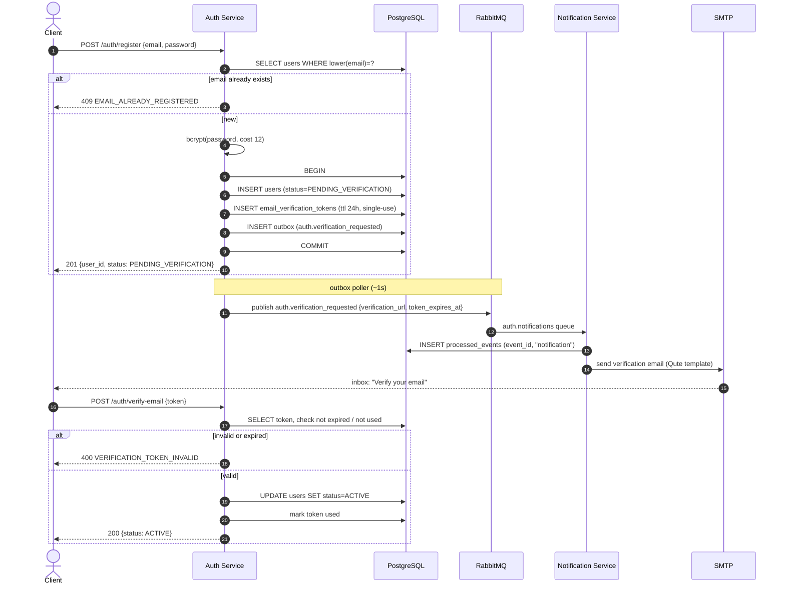

**Notes**
- `auth.*` events are **email-only** and bypass the `notification_preferences` matrix ([9 §2](9%20-%20Event%20Catalog.md)).
- Until `ACTIVE`, the user can log in but hits `403 EMAIL_NOT_VERIFIED` on publish / respond / message / review / appearing in search ([4 § Email Registration](4%20-%20Business%20logic.md)).
- Resend: `POST /auth/resend-verification` — 1 / 60 s, ≤ 5 / h; each new token invalidates the previous one.

### A2. Login (with lockout)
---

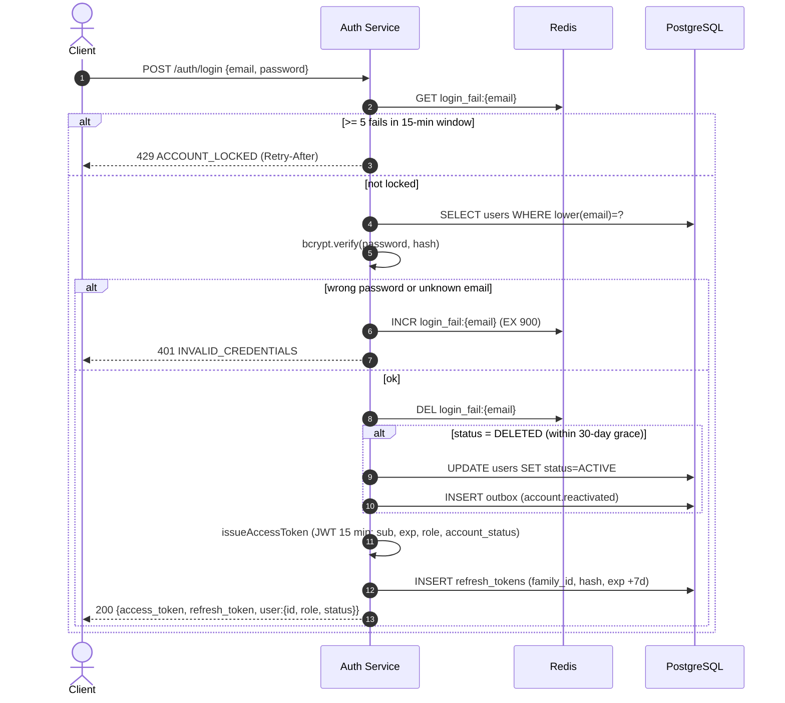

**Notes**
- Login **succeeds for `SUSPENDED` / `BANNED`** users — they need to reach the status / appeal screen ([8](8%20-%20API%20Specification.md), [4 § Report Workflow](4%20-%20Business%20logic.md)). Authorization for actions is enforced later, per-request, from the `account_status` claim.
- No separate login rate-limit beyond the lockout + the global NFR-Sec-7 policy.

### A3. Per-request authorization (how Core API trusts a JWT)
---

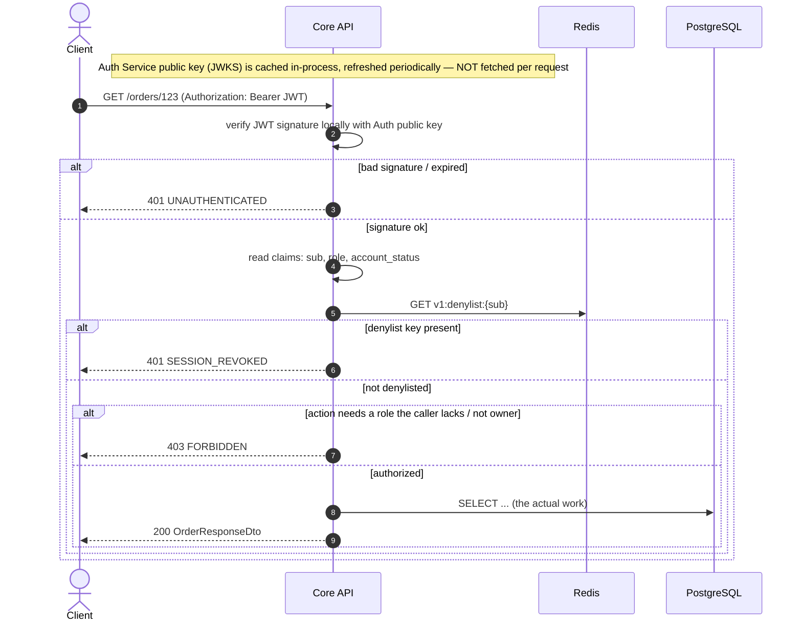

**Notes — resolves the file 3 ↔ file 4 inconsistency**
- **Local signature verification, no per-request HTTP call to Auth Service.** The only per-request network hop is one `GET` to Redis for the denylist. This matches [4 § Sessions & Tokens](4%20-%20Business%20logic.md); [3 - System Design.md](3%20-%20System%20Design.md) v1.3 was corrected to match (it previously said "validates JWT tokens with Auth Service … every request").
- `v1:denylist:{user_id}` is `SET … EX 900` on ban, suspension, role change, password change, or logout-all. Because the access token lives only 15 min (< 900 s), a denylist entry outlives every token it needs to kill.
- Same verification runs in the Messaging Service before the WebSocket upgrade (A-side of D-flows) and in every service with authenticated endpoints (`SessionDenylistCheck`, [7 § Shared](7%20-%20Application%20Classes.md)).

### A4. Token refresh — rotation + reuse detection
---

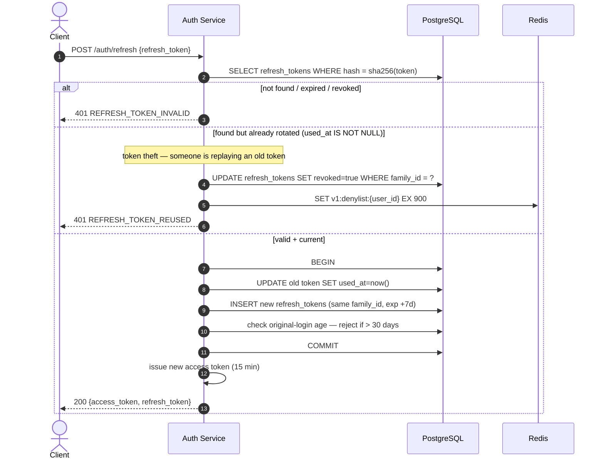

**Notes**
- Sliding window: every refresh grants a fresh 7-day refresh token. Absolute cap: 30 days from the original login, then full re-login regardless of activity.
- Reuse of a rotated token nukes the **whole family** and denylists the user — both the thief and the victim are logged out, victim re-authenticates.

### A5. Google OAuth — first login + role selection
---

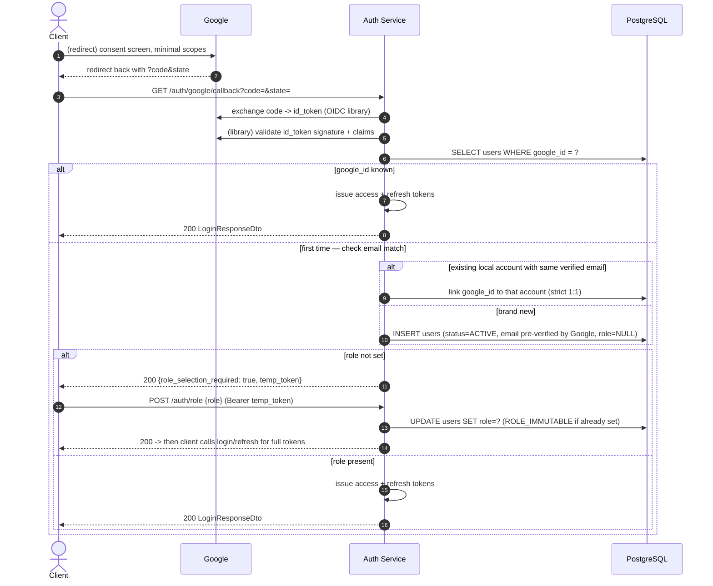

**Notes**
- Google accounts arrive **email pre-verified** — no `PENDING_VERIFICATION` step.
- Strict 1:1: a Google identity links to exactly one ProFinder account (`GOOGLE_ACCOUNT_ALREADY_LINKED` otherwise).
- Unlink requires a password already set, else the "set password" flow first (A6 variant) — prevents self-lockout.

### A6. Password reset
---

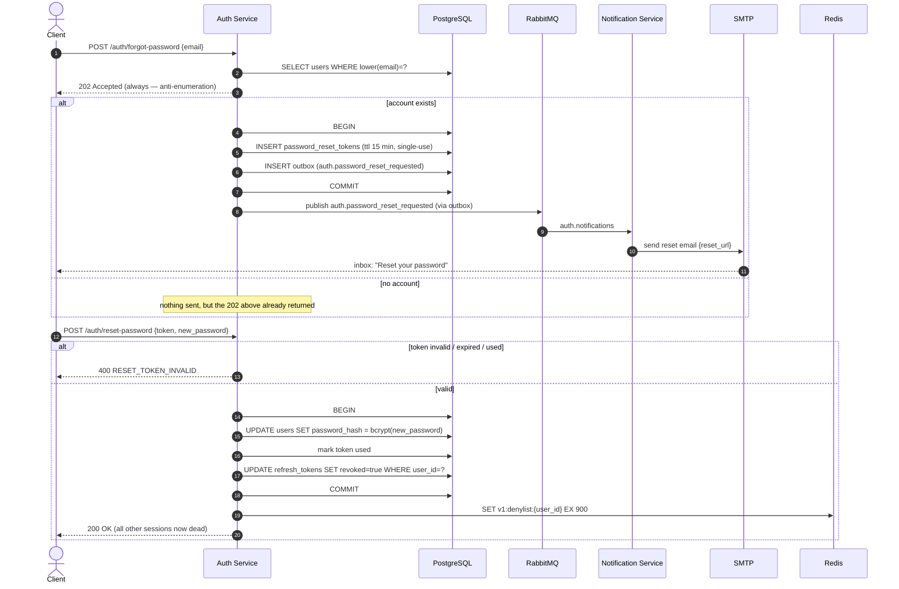

## B. Orders & Responses
---

### B1. Publish order → notify matching professionals → index
---

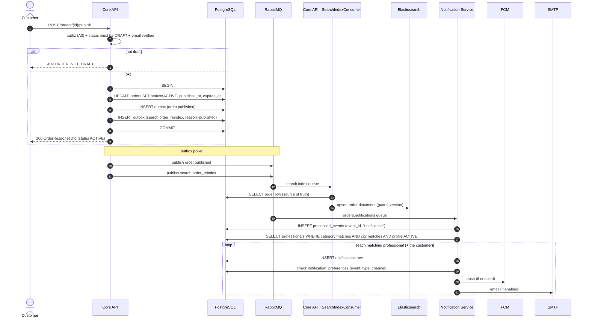

**Notes**
- The two outbox rows commit atomically with the status change — a broker outage delays delivery, never drops it.
- `search.order_reindex` and `order.published` are **separate events on separate queues** with separate consumers ([9 §3](9%20-%20Event%20Catalog.md)). The indexer ignores `order.published`; Notification Service never sees `search.*`.
- Matching is exact category + exact city (flat category list, city-only match — [4 § Location and Categories](4%20-%20Business%20logic.md)).
- Consumer is idempotent: a redelivered `order.published` hits the `processed_events` PK and is dropped before any duplicate push.

### B2. Professional submits a response
---

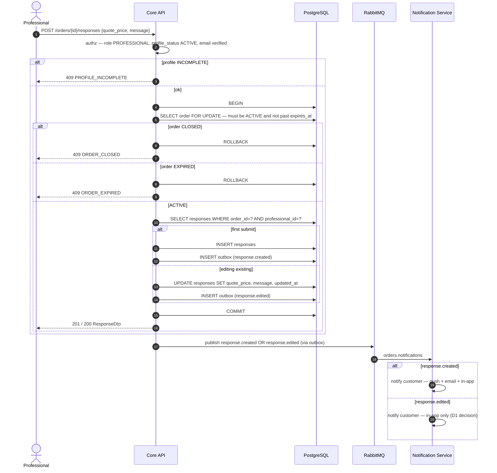

**Notes**
- One response per professional per order — the second `POST` is an edit (`201` vs `200`). Sealed bids: the professional never sees other responses or a count.
- The `SELECT … FOR UPDATE` on the order row is what makes "response created just as the customer closes the order" resolve deterministically to one side.

## C. Communication
---

### C1. Chat message over WebSocket (with offline fallback to notification)
---

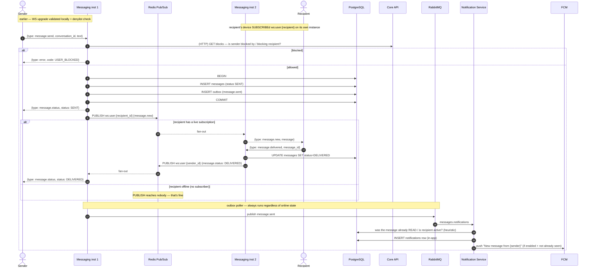

**Notes**
- **No LB sticky sessions.** Delivery is `PUBLISH ws:user:{recipient_id}`; Redis fans out to whatever instance(s) hold that subscription. Multi-device = multiple subscribers on the same channel ([8 § Messaging](8%20-%20API%20Specification.md)).
- On reconnect the client calls `GET /conversations/{id}/messages?after={last_seen_id}` to backfill — Pub/Sub has no replay. Same endpoint is the WebSocket-unavailable fallback.
- `message.sent` → Notification Service is the path that reaches an **offline** recipient (push / email / in-app). An online, actively-viewing recipient may get the in-app row suppressed or auto-read.
- `message.deleted` (not drawn): sender calls `DELETE /messages/{id}` → soft-hide + `PUBLISH` a removal to the other party + `message.deleted` event so Notification Service drops any stale unread row. Hard purge after the moderator-review grace period.

## D. Reviews, Search, Files
---

### D1. Post a review → sync moderation → rating recalc → cache bust → reindex
---

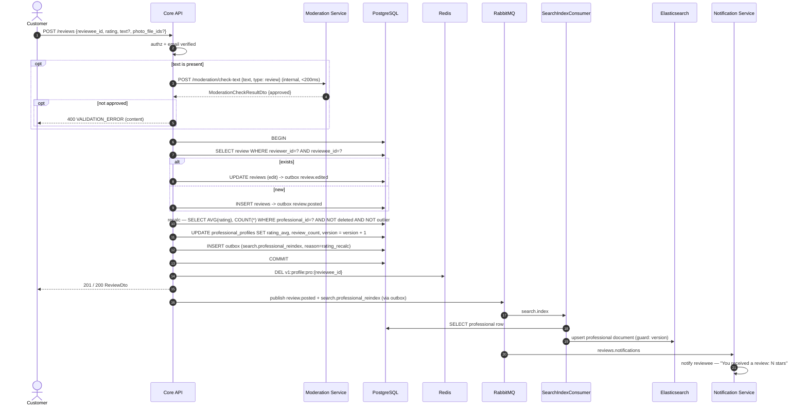

**Notes**
- Rating is **denormalized columns recalculated synchronously in the same transaction**, not a cache ([4 § Professional Rating](4%20-%20Business%20logic.md)). The search sort key `sort_rating` (Bayesian) is derived from those columns.
- Profile cache is **delete-on-write** right after commit; the search result-page cache is just left to expire (60 s TTL, no active bust).
- `review.edited` does **not** re-notify; it still triggers the reindex if the rating moved.
- Moderation sync check is **MVP**; the async ML pipeline is Phase 2 and would add a callback `POST /reviews/{id}/moderation-result`.

### D2. Search request (cache → Elasticsearch)
---

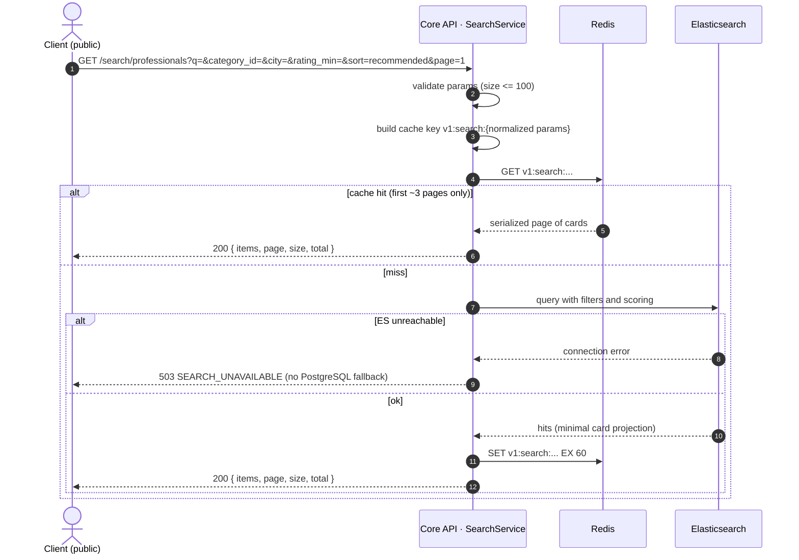

**Notes**
- Result cards come **straight from the ES document** — `id, display_name, avatar_thumb_url, rating, review_count, hourly_rate`. Full profile loads separately on click.
- No fallback to PostgreSQL on ES failure — deliberate ([4 § Search Failure Handling](4%20-%20Business%20logic.md)). The nightly full reindex + queued reindex events keep ES eventually correct.

### D3. File upload (avatar / portfolio / evidence / attachment)
---

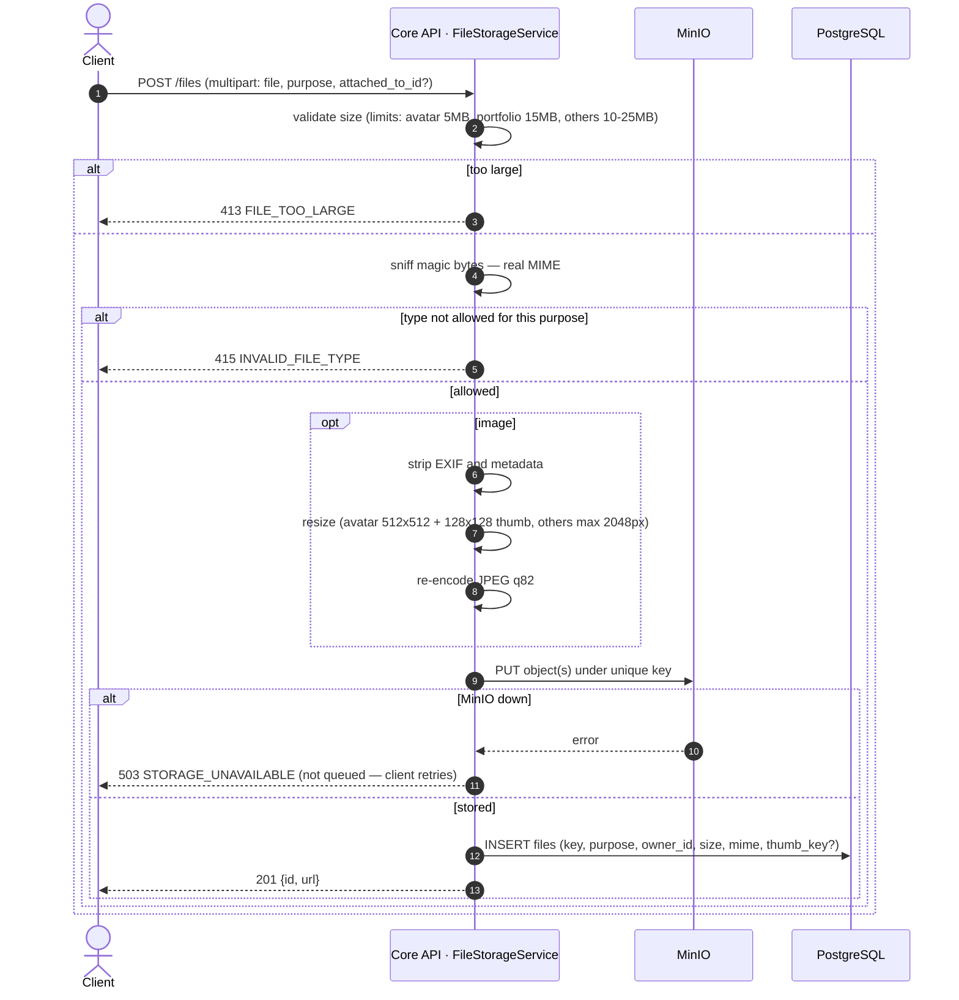

**Notes**
- Synchronous, straight through Core API — no presigned-URL round trip, no async processing queue in MVP.
- `GET /files/{id}` → `302` to the MinIO object URL; public for avatar/portfolio, owner/Moderator-gated for review & report evidence.
- Delete removes the object immediately (no delayed GC). No virus scan in MVP.

## E. Moderation & Account lifecycle
---

### E1. Report → moderator decision (ban) → cascade
---

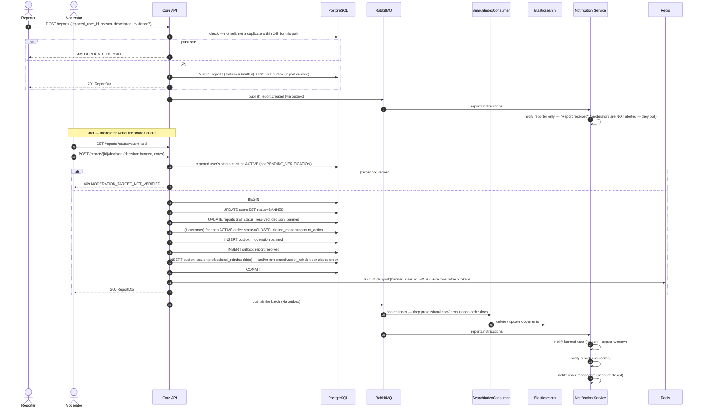

**Notes**
- All state changes + every outbox row are **one transaction**. The denylist `SET` + refresh-token revocation happen right after commit so the banned user is logged out within seconds.
- Suspension is the same shape with `status=SUSPENDED` + `suspension_end_date`; a scheduled job (or lazy check at next login) flips it back to `ACTIVE` and emits a reinstatement reindex.
- Ban appeal: `POST /ban-appeals` within 30 days → reviewed by a **different** moderator (`SAME_MODERATOR_REVIEW` guard), one appeal only.

### E2. Account deletion → 30-day grace → finalize
---

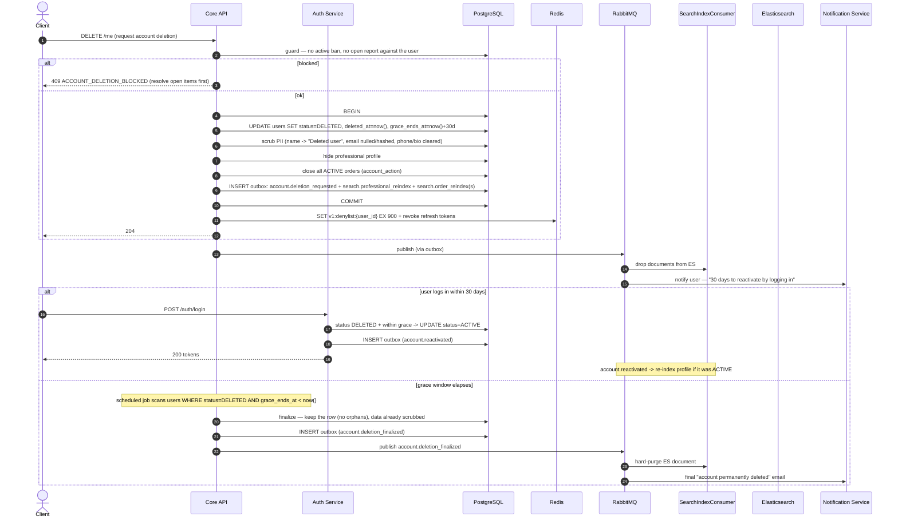

**Notes**
- Soft delete — the DB row is **kept** and anonymized so no order/response/review/message is ever orphaned ([4 § Concurrency & Edge Cases](4%20-%20Business%20logic.md)). Reviews the user *wrote* stay, anonymized.
- Reactivation is just "log in during the grace window" — no separate endpoint.
- PII scrub happens **at request time**, not at finalize; finalize is mostly the ES purge + the final notification.

## Changelog
---

| Version | Date | Change |
|---|---|---|
| 1.1 | 2026-09-10 | Standardised to the shared doc format. Account-deletion guard now returns `409 ACCOUNT_DELETION_BLOCKED` (was bare `409 CONFLICT`), matching [8 - API Specification.md](8%20-%20API%20Specification.md). Token-table inserts renamed to `email_verification_tokens` / `password_reset_tokens` to match [6 - Database Schema.md](6%20-%20Database%20Schema.md). |
| 1.0 | 2026-09-07 | Initial: 14 sequence diagrams across Auth (register/verify, login, per-request authz, refresh+rotation, Google OAuth, password reset), Orders (publish, respond), Communication (WebSocket chat), Reviews/Search/Files, Moderation/Account (report→ban cascade, deletion→grace→finalize). Diagram A3 states the resolution of the file 3 ↔ file 4 JWT-validation inconsistency (local verify + Redis denylist); file 3 was corrected to match in v1.3. |
