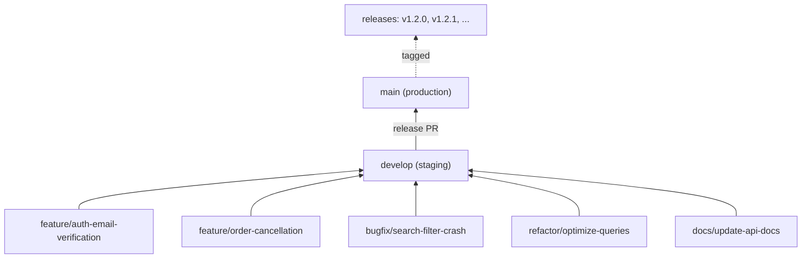

# ProFinder — SDLC & Development Workflow

- **Version:** 1.1
- **Date:** 2026-09-10
- **Status:** Draft
- **Purpose:** The Software Development Lifecycle for ProFinder — repository structure, development workflow, environments, CI/CD pipeline, and how Claude integrates. Partially delivers Documentation Roadmap Tier 3 (docker-compose, CI/CD, testing strategy, environments, git workflow).

---

## Overview
---

ProFinder uses a **monorepo** with 5 microservices, docker-compose for local dev, Kubernetes for production, and GitHub Actions for CI/CD. Claude Code plays a key role in development with full context from documentation.


## 1. Repository Structure (Monorepo)
---

```text
profinder/
├── .claude/
│   ├── config.json              ← Claude Code configuration
│   ├── settings.json            ← Permissions & hooks
│   └── agents/
│       ├── code-reviewer.md
│       ├── test-writer.md
│       └── deployment-advisor.md
├── .github/workflows/
│   ├── test.yml                 ← Unit + integration tests
│   ├── quality.yml              ← Checkstyle + SonarQube
│   └── deploy.yml               ← Build & push to K8s
├── docs/
│   ├── CLAUDE.md               ⭐ Main guide for Claude
│   ├── SETUP.md                ← Local dev (docker-compose)
│   ├── TESTING.md              ← Test strategy & patterns
│   ├── CONTRIBUTING.md         ← Code standards & Git workflow
│   ├── DEPLOYMENT.md           ← K8s, Helm, release process
│   ├── CODE_STANDARDS.md       ← Checkstyle rules, formatting
│   ├── CODE_PATTERNS.md        ← Quarkus examples, best practices
│   ├── TROUBLESHOOTING.md      ← Common issues & solutions
│   └── IT/ProFinder/
│       ├── 1 - Description.md
│       ├── 2 - Requirements.md
│       ├── 3 - System Design.md
│       ├── 4 - Business logic.md
│       ├── 5 - State Machines.md
│       ├── 6 - Database Schema.md
│       ├── 7 - Application Classes.md
│       ├── 8 - API Specification.md
│       ├── 9 - Event Catalog.md
│       ├── 10 - Sequence Diagrams.md
│       ├── 11 - Permission Matrix.md
│       ├── 12 - Elasticsearch Mapping.md
│       ├── 13 - Validation Rules.md
│       ├── 14 - Category Taxonomy.md
│       └── 15 - SDLC & Workflow.md (this file)
├── services/
│   ├── core-api/
│   │   ├── src/main/java/com/profinder/...
│   │   ├── src/test/java/com/profinder/...
│   │   ├── pom.xml
│   │   └── Dockerfile
│   ├── auth-service/
│   │   ├── src/main/java/...
│   │   ├── src/test/java/...
│   │   ├── pom.xml
│   │   └── Dockerfile
│   ├── messaging-service/
│   ├── notification-service/
│   └── moderation-service/
├── k8s/
│   ├── namespaces.yaml
│   ├── core-api-deployment.yaml
│   ├── auth-service-deployment.yaml
│   ├── messaging-service-deployment.yaml
│   ├── notification-service-deployment.yaml
│   ├── moderation-service-deployment.yaml
│   ├── postgres-statefulset.yaml
│   ├── rabbitmq-deployment.yaml
│   ├── redis-deployment.yaml
│   ├── elasticsearch-deployment.yaml
│   └── minio-deployment.yaml
├── docker-compose.yml           ← Local dev (all services + deps)
├── docker-compose.prod.yml      ← Production-like config for staging
├── pom.xml                      ← Parent Maven POM
├── README.md                    ← Quick start guide
└── memory/
    ├── profinder-overview.md    ← Claude Code memory
    ├── validation-rules.md
    └── claude-workflows.md
```

**Key Points:**
- **Monorepo**: All 5 services in one repo → easier coordination, shared CI/CD
- **docs/**: Local copies for Claude Code to read (mirrors GitHub Wiki for humans)
- **services/**: Each service is independent Maven module with own tests
- **.claude/**: Configuration for Claude Code integration
- **.github/workflows/**: GitHub Actions automation
- **k8s/**: Kubernetes manifests (YAMLs)


## 2. Development Workflow (Issue → Production)
---

### **Step 1: GitHub Issue Created**
---

```text
Title: "[Service] Feature/Bug: Brief description"

Body:
## Context
[2-3 sentences explaining why this is needed]

## Requirements
- Link to [2 - Requirements.md § Relevant Section]
- Link to [6 - Database Schema.md § Relevant Tables]

## Acceptance Criteria
- [ ] Feature works as designed
- [ ] Unit tests written (≥80% coverage)
- [ ] Integration tests pass (Testcontainers)
- [ ] Code passes Checkstyle
- [ ] No secrets committed
- [ ] PR reviewed & approved

## Related Docs
- [2 - Requirements.md](...)
- [4 - Business logic.md](...)
- [8 - API Specification.md](...)
```

### **Step 2: Claude/Developer Reads Issue & Docs**
---

Claude reads:
- `docs/CLAUDE.md` → Project patterns, constraints, code standards
- Linked documentation (files 1–15) → Domain knowledge
- Existing code in `services/*/src/main/java` → Code patterns
- `docs/TESTING.md` → Test patterns & examples
- `docs/CODE_PATTERNS.md` → Quarkus best practices
- Memory → Persistent context about project

### **Step 3: Create Feature Branch**
---

```bash
git checkout develop
git pull origin develop
git checkout -b feature/auth-email-verification
```

**Branch naming:**
- `feature/*` for new features
- `bugfix/*` for bug fixes
- `refactor/*` for refactoring
- `docs/*` for documentation

### **Step 4: Implement + Test Locally**
---

**Start local environment:**
```bash
docker-compose up -d
# Wait for services to start
./mvnw clean verify -pl services/auth-service
```

**What to do:**
1. Write code in IDE (services/auth-service/src/main/java)
2. Write unit tests (src/test/java, use Mockito)
3. Write integration tests (use Testcontainers + @QuarkusTest)
4. Run tests: `./mvnw test -pl services/auth-service`
5. Run quality checks: `./mvnw checkstyle:check`
6. Check coverage: `./mvnw jacoco:report`

**Commit locally:**
```bash
git add services/auth-service/src/main/java/...
git commit -m "[AuthService] Add: Email verification flow

- Implement EmailService with template rendering
- Add VerificationTokenRepository
- Add unit tests (mock SmtpClient)
- Add integration tests (Testcontainers + real PostgreSQL)

See: [4 - Business logic.md § Auth]
     [6 - Database Schema.md § users table]
     [13 - Validation Rules.md § email field]"
```

**Commit message format:**
- `[ServiceName] Action: Brief description`
- Actions: Add, Fix, Refactor, Update, Remove, etc.
- Reference related docs in commit body

### **Step 5: Push & Create Pull Request**
---

```bash
git push origin feature/auth-email-verification
# Go to GitHub, create PR to develop branch
```

**PR Title:** `[AuthService] Add: Email verification flow`

**PR Description:**
```markdown
## What Changed
- Implemented EmailService for transactional emails
- Added VerificationTokenRepository with 24h expiry
- Added email validation per [13 - Validation Rules.md]

## Why
[4 - Business logic.md § Authentication] requires email verification within 24h.

## How to Test
1. `docker-compose up`
2. `curl -X POST http://localhost:8081/auth/register -d '{"email":"test@example.com","password":"Password123!"}'`
3. Check Mailhog at http://localhost:8025 for verification email
4. Click link to verify

## Tests
- ✓ Unit tests (EmailServiceTest): 12 cases, 100% coverage
- ✓ Integration tests (AuthControllerIntegrationTest): 8 cases with Testcontainers
- ✓ Checkstyle: PASS
- ✓ SonarQube: Quality gate PASS
- ✓ Coverage: 84%

## Related Docs
- [4 - Business logic.md § Authentication](...)
- [6 - Database Schema.md § email_verification_tokens](...)
- [8 - API Specification.md § POST /auth/register](...)
```

### **Step 6: GitHub Actions Auto-Checks**
---

**On PR creation, GitHub Actions runs:**
```text
✓ Compile (all services)
✓ Run unit tests (JUnit 5)
✓ Run integration tests (Testcontainers)
✓ Checkstyle (code style)
✓ SonarQube (code quality, security)
✓ Jacoco (coverage report ≥80%)
✓ OWASP dependency check

Status: ✅ All checks passed → Ready to review
        ❌ Some check failed → Fix and push again
```

**GitHub Actions won't pass if:**
- Tests fail
- Coverage < 80%
- Checkstyle violations exist
- SonarQube quality gate fails
- Security vulnerabilities found

### **Step 7: Code Review**
---

**Claude or human reviews:**
- Code quality & design
- Adherence to patterns from docs/CODE_PATTERNS.md
- Test coverage & quality
- Compliance with [13 - Validation Rules.md](13%20-%20Validation%20Rules.md)
- No breaking API changes
- No hardcoded secrets

**Approval:**
```text
Approved by: reviewer
Comment: "Looks good, follows the transactional outbox pattern correctly"
```

### **Step 8: Manual Merge to develop**
---

After approval:
```bash
# In GitHub UI, click "Merge pull request"
# Delete feature branch
```

Or via command line:
```bash
git checkout develop
git pull origin develop
git merge feature/auth-email-verification
git push origin develop
```

### **Step 9: Auto-Deploy to STAGING**
---

**Triggered by:** Merge to develop

**What happens (GitHub Actions):**
```text
1. Trigger GitHub Actions deploy.yml workflow
2. Build Docker images for changed services
3. Tag images: latest, short-sha, timestamp
4. Push to Docker registry
5. Update K8s deployment manifests
6. Apply to K8s staging cluster
7. Wait for rollout to complete
8. Run smoke tests (health checks, basic API calls)
9. Verify all services are running
10. Post status to GitHub Deployments
```

**Result:** Staging environment updated with new code

### **Step 10: QA Testing on Staging**
---

**QA testers verify:**
- Feature works end-to-end
- No regressions in other features
- Database migrations applied correctly
- Events are flowing through RabbitMQ
- Search indexing works (Elasticsearch)
- Notifications sent correctly
- File uploads work (MinIO)

**If issues found:**
```text
Create new issue or bug report
Link to PR and staging deployment
Developer fixes → new PR → repeat workflow
```

### **Step 11: Create Release (PR: develop → main)**
---

When ready to release:
```bash
# From develop branch
git checkout develop
git pull origin develop
git checkout main
git pull origin main
git merge develop
git tag v1.2.0 -m "Release v1.2.0

## Changes
- [AuthService] Add email verification flow
- [CoreAPI] Fix order deadline calculation
- [Notification] Add SMS support (experimental)

## Bug Fixes
- Fix JWT validation race condition
- Fix Elasticsearch mapping for city names

## Breaking Changes
None

## Deployment Notes
- Requires DB migration V015 (email_verification_tokens table)
- Elasticsearch re-index recommended
- RabbitMQ queues will be auto-created

See full changelog: [GitHub Releases](...)
"
git push origin main --tags
```

**Or use GitHub UI:**
```text
Create Release from GitHub → specify tag v1.2.0 → write release notes → publish
```

**Release Notes Include:**
- Features added
- Bugs fixed
- Breaking changes (if any)
- Migration instructions
- Deployment notes
- Known issues (if any)

### **Step 12: Auto-Deploy to PRODUCTION**
---

**Triggered by:** Git tag created (v1.2.0)

**What happens (GitHub Actions):**
```text
1. Trigger deploy.yml for production environment
2. Re-run all tests + quality checks
3. Build final Docker images
4. Tag images: v1.2.0, latest
5. Push to Docker registry (prod)
6. Apply K8s manifests to production cluster
7. Kubernetes rolling update (no downtime)
   - New replicas start
   - Old replicas gradually stop
   - Health checks verify new replicas are ready
8. Update load balancer routing
9. Run production smoke tests
10. Alert team via Slack/email (deployment complete)
```

**Result:** Production running new version


## 3. Three Environments
---

### **Local Development**
---

```bash
docker-compose up -d
# Starts:
# - 5 services (Java on localhost:8080-8084)
# - PostgreSQL on :5432
# - RabbitMQ on :5672 + :15672 (management)
# - Redis on :6379
# - Elasticsearch on :9200
# - MinIO on :9000
# - Mailhog on :1025 (SMTP) + :8025 (UI)

# Logs:
docker-compose logs -f core-api
docker-compose logs -f auth-service
...

# Stop:
docker-compose down
```

**Purpose:** Fast iteration, testing, experimenting
**Data:** Test data, easily reset
**Risk:** None (local only)
**Rollback:** `git checkout` + restart

### **Staging**
---

```yaml
Environment: Kubernetes cluster (separate from prod)
Deploy: Automatic on develop merge
Database: Test data (copy or fresh)
Scale: 1-2 replicas per service
Health Checks: Yes
Monitoring: Yes
Access: Team only (not public)
TTL: Keep until next prod release
```

**Purpose:**
- Full end-to-end testing before production
- QA verification
- Performance testing
- Testing database migrations
- Testing infrastructure changes

**Workflow:**
1. Code merged to develop
2. Auto-deploy to staging (GitHub Actions)
3. QA tests feature
4. If ok → create release PR
5. If not ok → new bug fix PR

### **Production**
---

```yaml
Environment: Kubernetes cluster (HA setup)
Deploy: Manual tagged release only
Database: Real data, backed up
Scale: 3+ replicas per service (auto-scaling)
Health Checks: Yes, strict
Monitoring: Yes, detailed alerts
Access: Real users
Backup: Daily, tested recovery
Rollback: Possible via kubectl rollout
```

**Access:**
- Public API via Nginx
- Monitoring dashboard
- Logs aggregation
- Alerting (Slack, email, etc.)


## 4. Git Workflow & Branching Strategy
---

### **Branch Structure**
---



### **Branch Naming**
---

- `feature/*` — New features
- `bugfix/*` — Bug fixes
- `refactor/*` — Code refactoring
- `docs/*` — Documentation
- `chore/*` — Dependencies, build config

### **Commit Message Format**
---

**Single-line commits** (for small changes):
```text
[ServiceName] Action: Brief description
```

**Multi-line commits** (for larger changes):
```text
[ServiceName] Action: Brief one-liner

Detailed explanation of what and why.
- Point 1
- Point 2
- Point 3

Related docs:
- [4 - Business logic.md § Relevant section]
- [6 - Database Schema.md § Relevant table]

Fixes: #123 (GitHub issue number)
```

**Actions:**
- `Add` — New feature
- `Fix` — Bug fix
- `Update` — Enhancement to existing feature
- `Remove` — Delete code/feature
- `Refactor` — Code reorganization (no logic change)
- `Docs` — Documentation only

### **PR Review Checklist**
---

Before approving a PR, verify:
- [ ] Code compiles without errors
- [ ] All tests pass (unit + integration)
- [ ] Coverage ≥ 80%
- [ ] Checkstyle passes
- [ ] SonarQube quality gate passes
- [ ] No hardcoded secrets (API keys, passwords)
- [ ] No breaking API changes (or documented)
- [ ] Follows code patterns from docs/CODE_PATTERNS.md
- [ ] Adheres to [13 - Validation Rules.md](13%20-%20Validation%20Rules.md)
- [ ] Database schema changes have Flyway migrations
- [ ] New events documented in [9 - Event Catalog.md](9%20-%20Event%20Catalog.md)
- [ ] Commit messages are clear & reference docs
- [ ] PR description explains what & why


## 5. CI/CD Pipeline (GitHub Actions)
---

### **Workflows**
---

CI/CD is split into 3 separate workflows:

| Workflow | Trigger | Purpose | Duration | Jobs |
|----------|---------|---------|----------|------|
| **ci.yml** | Push + PR (all branches) | Build → Test → Quality (3 sequential jobs) | ~10-15 min | build, test, quality |
| **e2e.yml** | Push to develop | Full E2E tests (docker-compose) | ~10-20 min | e2e |
| **deploy.yml** | Git tags (v*) | Build + Push Docker + Deploy | ~5-10 min | deploy |

---

#### **ci.yml** — Build + Test + Quality (3 Sequential Jobs)
---

**Triggers:** `on: [push, pull_request]`

**Runs:** Three sequential jobs:
1. **build** — compile sources (~2 min)
2. **test** — unit + integration tests (~5 min)
3. **quality** — checkstyle + sonarqube (~5 min)

```yaml
name: CI

on:
  push:
    branches: [ '**' ]
  pull_request:
    branches: [ '**' ]

jobs:
  build:
    runs-on: ubuntu-latest
    steps:
      - uses: actions/checkout@v4
      - uses: actions/setup-java@v4
        with:
          java-version: 21
          cache: maven
      - run: mvn -B clean test-compile -Dmaven.test.skip=true
      - run: mvn -B clean verify
      - run: mvn -B checkstyle:checkstyle
```

**What it does:**
- Compiles all sources
- Runs unit + integration tests (with real PostgreSQL, Redis, Elasticsearch)
- Runs checkstyle checks
- Runs SonarQube analysis
- Uploads coverage to Codecov

---

#### **e2e.yml** — End-to-End Tests on Develop
---

**Triggers:** `on: [push]` to `develop` branch only

**Runs:** Full E2E tests using docker-compose

```yaml
name: E2E Tests
on:
  push:
    branches: [ develop ]

jobs:
  e2e:
    runs-on: ubuntu-latest
    steps:
      - uses: actions/checkout@v4
      - uses: actions/setup-java@v4
        with:
          distribution: temurin
          java-version: 21
          cache: maven
      - run: mvn -B clean verify
      - run: mvn -B jacoco:report
      - uses: codecov/codecov-action@v3
```

**What it checks:**
- ✓ Compile all code
- ✓ Run unit tests (JUnit 5)
- ✓ Run integration tests (with real PostgreSQL)
- ✓ Code coverage (Jacoco report)

---

#### **quality.yml** — Code quality checks on PR only
---

**Triggers:** `on: [pull_request]` (only on PR, not on every push)

**Runs:** Checkstyle + SonarQube + OWASP dependency check

```yaml
name: Quality
on:
  pull_request:
    branches: [ '**' ]

jobs:
  quality:
    runs-on: ubuntu-latest
    steps:
      - uses: actions/checkout@v4
        with:
          fetch-depth: 0
      - uses: actions/setup-java@v4
        with:
          distribution: temurin
          java-version: 21
          cache: maven
      
      - name: Run Checkstyle
        run: mvn -B checkstyle:checkstyle
      
      - name: Run SonarQube analysis
        run: mvn -B clean verify sonar:sonar
        env:
          SONAR_HOST_URL: ${{ secrets.SONAR_HOST_URL }}
          SONAR_LOGIN: ${{ secrets.SONAR_LOGIN }}
        continue-on-error: true
      
      - name: Check SonarQube quality gate
        uses: sonarsource/sonarqube-quality-gate-action@v1.2.0
        env:
          SONAR_LOGIN: ${{ secrets.SONAR_LOGIN }}
        continue-on-error: true
      
      - name: OWASP Dependency Check
        run: mvn -B org.owasp:dependency-check-maven:check
        continue-on-error: true
```

**What it checks:**
- ✓ Checkstyle (code style, formatting)
- ✓ SonarQube (bugs, code smells, security)
- ✓ OWASP (known vulnerabilities in dependencies)

**Why only on PR?**
- Saves time during feature branch development
- Full quality check only when ready to merge
- PR cannot merge if quality gate fails

---

#### **e2e.yml** — End-to-end tests on develop
---

**Triggers:** `on: [push]` to `develop` branch only

**Runs:** Full E2E tests using docker-compose (all services running together)

```yaml
name: E2E Tests
on:
  push:
    branches: [ develop ]

jobs:
  e2e:
    runs-on: ubuntu-latest
    steps:
      - uses: actions/checkout@v4
      - uses: actions/setup-java@v4
        with:
          distribution: temurin
          java-version: 21
          cache: maven
      
      - name: Start all services with docker-compose
        run: docker-compose up -d
      
      - name: Wait for services to be ready
        run: sleep 30
      
      - name: Run E2E tests
        run: mvn -B test -Dtest='*E2E' -DskipITs=false
        continue-on-error: true
      
      - name: Cleanup services
        if: always()
        run: docker-compose down -v
```

**What it checks:**
- ✓ Full user workflows (Register → Create Order → Review)
- ✓ Multiple services working together
- ✓ Real database, Elasticsearch, RabbitMQ all running
- ✓ End-to-end functionality

**When does it run?**
- After code is merged to `develop`
- Not on every feature branch (too slow)
- Before creating release PR to main

---

#### **deploy.yml** — Build & deploy on release tags
---

**Triggers:** `on: [push]` with git tags matching `v*` (e.g., v1.0.0)

**Runs:** All tests + Build Docker images + Push to registry

```yaml
name: Deploy
on:
  push:
    tags:
      - 'v*'

jobs:
  deploy:
    runs-on: ubuntu-latest
    steps:
      - uses: actions/checkout@v4
      - uses: actions/setup-java@v4
        with:
          distribution: temurin
          java-version: 21
          cache: maven
      
      - name: Run all tests and quality checks
        run: mvn -B clean verify
      
      - name: Run SonarQube analysis
        run: mvn -B sonar:sonar
        env:
          SONAR_HOST_URL: ${{ secrets.SONAR_HOST_URL }}
          SONAR_LOGIN: ${{ secrets.SONAR_LOGIN }}
        continue-on-error: true
      
      - name: Build Docker image
        run: docker build -t profinder/core-api:${{ github.ref_name }} -f src/main/docker/Dockerfile.jvm .
      
      - name: Login to Docker registry
        run: echo "${{ secrets.DOCKER_PASSWORD }}" | docker login -u "${{ secrets.DOCKER_USERNAME }}" --password-stdin
        continue-on-error: true
      
      - name: Push Docker image to registry
        run: docker push profinder/core-api:${{ github.ref_name }}
        continue-on-error: true
      
      - name: Print deployment info
        run: |
          echo "Version: ${{ github.ref_name }}"
          echo "Image: profinder/core-api:${{ github.ref_name }}"
          echo "Ready for deployment to production"
```

**What it does:**
- ✓ Re-run all tests (safety check)
- ✓ Build Docker image with tag (e.g., profinder/core-api:v1.0.0)
- ✓ Push image to Docker registry
- ✓ Ready for K8s deployment (manual step)


## 6. Testing Strategy
---

### **Unit Tests** (40-50% of code)
---

**What to test:**
- Business logic (calculations, validations, state transitions)
- Error handling & edge cases
- Mocked dependencies (database, external APIs)

**Tools:** JUnit 5, Mockito, AssertJ

**Example:**
```java
@Test
void testPasswordValidationRejectsWeakPassword() {
    PasswordValidator validator = new PasswordValidator();
    
    assertThrows(ValidationException.class, () -> {
        validator.validate("weak123");  // No uppercase
    });
    
    assertThrows(ValidationException.class, () -> {
        validator.validate("ValidButNoSpecial123");  // No special char
    });
}
```

### **Integration Tests** (30-40% of code)
---

**What to test:**
- Service + real database (via Testcontainers)
- Service + RabbitMQ
- Transactional behavior
- Event publishing

**Tools:** Testcontainers, @QuarkusTest, RestAssured

**Example:**
```java
@QuarkusTest
class AuthServiceIntegrationTest {
    @InjectMock
    PostgreSqlContainer postgres;
    
    @Test
    void testRegisterAndVerifyEmail() {
        // Real database
        var userId = authService.register("test@example.com", "Password123!");
        
        // Verify in DB
        var user = userRepository.findById(userId);
        assertThat(user.getStatus()).isEqualTo(AccountStatus.PENDING_VERIFICATION);
        
        // Verify token sent
        var token = emailTokenRepository.findByUserId(userId);
        assertThat(token).isNotNull();
    }
}
```

### **E2E Tests** (10-20% of code)
---

**What to test:**
- Full feature flow via REST API
- Multiple services working together
- Complete user journeys
- Database + Elasticsearch + RabbitMQ all running

**Where it runs:**
- **Workflow:** `e2e.yml`
- **Trigger:** Push to `develop` branch (after merging feature PR)
- **Duration:** ~10-20 minutes
- **Requirement:** `docker-compose up -d` to start all services

**Tools:** RestAssured, docker-compose for all services

**Example:**
```java
@QuarkusTest
class OrderE2ETest {
    @Test
    void testCustomerOrdersAndProfessionalResponds() {
        // Customer registers
        var customerId = given()
            .body("""
                {"email":"customer@example.com","password":"Pass123!","role":"CUSTOMER"}
                """)
            .post("/api/v1/auth/register")
            .then().statusCode(201)
            .extract().jsonPath().getString("userId");
        
        // Customer creates order
        var orderId = given()
            .auth().oauth2(customerToken)
            .body("""
                {"title":"Fix plumbing","category_id":"plumbing","location":"NYC"}
                """)
            .post("/api/v1/orders")
            .then().statusCode(201)
            .extract().jsonPath().getString("id");
        
        // Professional searches & responds
        var responses = given()
            .auth().oauth2(professionalToken)
            .get("/api/v1/orders?category_id=plumbing&city=NYC")
            .then().statusCode(200)
            .extract().jsonPath().getList("orders");
        
        assertThat(responses).anySatisfy(order -> {
            given()
                .auth().oauth2(professionalToken)
                .body("{\"quote_price\":150.00,\"message\":\"I can help\"}")
                .post("/api/v1/orders/" + orderId + "/responses")
                .then().statusCode(201);
        });
    }
}
```

**File naming:** Class names ending with `*E2E.java` (e.g., `OrderE2ETest.java`)

### **Coverage Goals**
---

- **Target:** ≥ 80% line coverage
- **Not critical:** 100% coverage (test complexity vs value)
- **Skip testing:** Getters/setters, simple constructors, generated code


## 7. Code Quality Standards
---

### **Checkstyle** (code formatting)
---

**Enforced:**
- Line length: max 120 chars
- Indentation: 4 spaces (no tabs)
- Naming conventions: camelCase for variables, PascalCase for classes
- Import order
- Javadoc on public methods

**Run locally:**
```bash
./mvnw checkstyle:check

# Or auto-fix:
./mvnw spotless:apply
```

### **SonarQube** (code quality)
---

**Checks:**
- Code smells (complexity, duplication)
- Security vulnerabilities
- Bugs (potential runtime errors)
- Code coverage
- Technical debt

**Quality gate:** Must pass to merge

### **OWASP Dependency Check**
---

**Checks:**
- Known security vulnerabilities in dependencies
- Outdated packages

**Fail on:** High/Critical vulnerabilities

### **Code Patterns** (from docs/CODE_PATTERNS.md)
---

**Must follow:**
- Transactional outbox for events (see [9 - Event Catalog.md](9%20-%20Event%20Catalog.md))
- Testcontainers for integration tests (not mocks)
- Jakarta validation annotations (see [13 - Validation Rules.md](13%20-%20Validation%20Rules.md))
- Optimistic locking for concurrent updates
- No hardcoded SQL (use ORM)


## 8. How Claude Integrates
---

### **Claude's Access**
---

**Can read:**
- ✅ docs/CLAUDE.md (project guide)
- ✅ docs/IT/ProFinder/* (all 15 files)
- ✅ docs/TESTING.md (patterns)
- ✅ docs/CODE_PATTERNS.md (examples)
- ✅ Existing code in services/*/src
- ✅ GitHub Issues (full task context)
- ✅ Memory (persistent context)

**Can do:**
- ✅ Edit code files
- ✅ Run tests locally (./mvnw test)
- ✅ Run quality checks (./mvnw checkstyle:check)
- ✅ Commit code (git commit)
- ✅ Push code (git push)
- ✅ Create PRs

**Cannot do:**
- ❌ Deploy to prod/staging
- ❌ Modify K8s manifests (needs manual review)
- ❌ Commit secrets
- ❌ Skip tests
- ❌ Change database structure without migrations

### **Claude's Task Loop**
---

```text
1. Read GitHub Issue
   → Understand requirements, acceptance criteria, linked docs

2. Read docs/CLAUDE.md
   → Understand project patterns, constraints, code standards

3. Read relevant docs (files 4, 6, 8, 13)
   → Business logic, database, API, validation

4. Read existing code
   → Learn patterns, conventions, existing implementations

5. Implement feature
   → Write code, write tests, run checks locally

6. Create PR
   → Link to docs, explain design decisions

7. Address review feedback
   → Iterate, test, push changes
```

### **Example: Claude's Response to Issue**
---

**Issue:**
```markdown
# [AuthService] Add: Email verification

## Requirements
See [2 - Requirements.md § FR-Auth-1]

## Acceptance Criteria
- [ ] Endpoint POST /auth/register
- [ ] Email verification link (24h)
- [ ] Password validation (8 chars, complexity)
- [ ] Tests (unit + integration)
```

**Claude's Process:**
1. Reads `docs/CLAUDE.md` → learns project patterns
2. Reads `docs/IT/ProFinder/2 - Requirements.md § FR-Auth-1` → understands requirements
3. Reads `docs/IT/ProFinder/4 - Business logic.md § Authentication` → learns business rules
4. Reads `docs/IT/ProFinder/6 - Database Schema.md` → understands DB schema
5. Reads `docs/IT/ProFinder/8 - API Specification.md` → sees API patterns
6. Reads `docs/IT/ProFinder/13 - Validation Rules.md` → learns constraints
7. Reads existing code in `services/auth-service/src` → learns patterns
8. Writes code:
   - `AuthController.register()` endpoint
   - `AuthService.register()` with validation
   - `EmailService` with template
   - `VerificationTokenRepository`
9. Writes tests:
   - Unit: PasswordValidator, TokenGenerator
   - Integration: AuthServiceTest with Testcontainers
10. Runs locally:
    - `docker-compose up`
    - `./mvnw test -pl services/auth-service`
    - `./mvnw checkstyle:check`
11. Creates PR with explanation + links to docs
12. Addresses feedback from code review
13. PR merged, auto-deploys to staging


## 9. Rollback & Disaster Recovery
---

### **Local Development**
---

```bash
# If something breaks:
git reset --hard HEAD~1
docker-compose down -v
docker-compose up
./mvnw clean verify
```

### **Staging**
---

```bash
# Redeploy previous version:
git tag -l | sort -V | tail -2
# Say latest is v1.2.0, previous is v1.1.0

git checkout v1.1.0
docker-compose up
# Test
git checkout develop
```

### **Production**
---

**If deployment fails:**
```bash
# Kubernetes automatically rolls back failed deployments
# If you need to manually rollback:
kubectl rollout history deployment/core-api
# Shows all revisions (tied to image tags)

kubectl rollout undo deployment/core-api --to-revision=5
# Reverts to revision 5 (v1.1.0)

kubectl rollout status deployment/core-api
# Wait for rollback to complete
```

**Or re-deploy old tag:**
```bash
git checkout v1.1.0
git tag v1.2.0-rollback
git push --tags
# GitHub Actions deploys v1.2.0-rollback to prod
```


## 10. Communication & Tracking
---

### **GitHub Issues**
---

- Create issue for each feature/bug
- Link to relevant docs
- Assign to Claude or team member
- Track in GitHub Projects board

### **GitHub Projects Board**
---

```text
Columns:
- Backlog (not started)
- In Progress (assigned, being worked on)
- In Review (PR created, awaiting review)
- Staging (merged to develop, running on staging)
- Done (released to production)
```

### **Slack Notifications**
---

```text
@channel: Deploy started: v1.2.0 → staging
@channel: Deploy complete: v1.2.0 → production
@channel: Deployment failed: core-api rolled back to v1.1.0
```


## 11. Documentation Sync
---

### **/docs in Repo** (for Claude)
---

- Claude Code reads these locally
- Version controlled with git
- Linked from PRs and code

### **GitHub Wiki** (for Humans)
---

- Mirrors /docs content
- Better formatting & search
- Easier navigation
- Keep in sync manually or with GitHub Actions

### **Sync Strategy**
---

Option 1: Manual sync (simple)
- Update /docs → commit
- Update Wiki manually
- Both stay in sync

Option 2: Automatic sync (advanced)
- GitHub Actions reads /docs
- Pushes to Wiki via API
- Fully automated


## Summary
---

| Aspect | Details |
|--------|---------|
| **Repo** | Monorepo (5 services + docs) |
| **Local Dev** | docker-compose (all deps) |
| **Testing** | Unit + Integration + E2E (JUnit 5, docker-compose) |
| **Quality** | Checkstyle + SonarQube + coverage ≥80% |
| **Branching** | main (prod) ← develop (staging) ← feature/* |
| **CI/CD Workflows** | test.yml (push/PR) + quality.yml (PR) + e2e.yml (develop) + deploy.yml (tags) |
| **Environments** | Local → Staging (auto on develop) → Prod (manual on tags) |
| **Docs** | /docs in repo + GitHub Wiki (synced) |
| **Claude** | Reads docs, writes code, creates PRs |
| **Rollback** | Git tags on Kubernetes |
| **Release** | Tagged release with release notes |


## Changelog
---

| Version | Date | Change |
|---|---|---|
| 1.2 | 2026-09-11 | Split monolithic CI workflow into 4 separate files: test.yml (unit + integration on push/PR), quality.yml (checkstyle + SonarQube on PR only), e2e.yml (end-to-end tests on develop push), deploy.yml (build + push Docker on git tags). Updated action versions from v3 to v4. Added explicit E2E test section with docker-compose requirement. |
| 1.1 | 2026-09-10 | Standardised to the shared doc format (metadata block, separators, changelog). "files 1–14" / "all 14 files" → 15. `verification_tokens` references → `email_verification_tokens` (matches [6 - Database Schema.md](6%20-%20Database%20Schema.md)). Removed the "Next Steps" section — its items live in [Documentation Roadmap.md](Documentation%20Roadmap.md) Tier 3. |
| 1.0 | 2026-09-07 | Initial. Monorepo layout, issue→production workflow, three environments, git branching, CI/CD workflows, testing strategy, code-quality standards, Claude integration, rollback/DR. |
