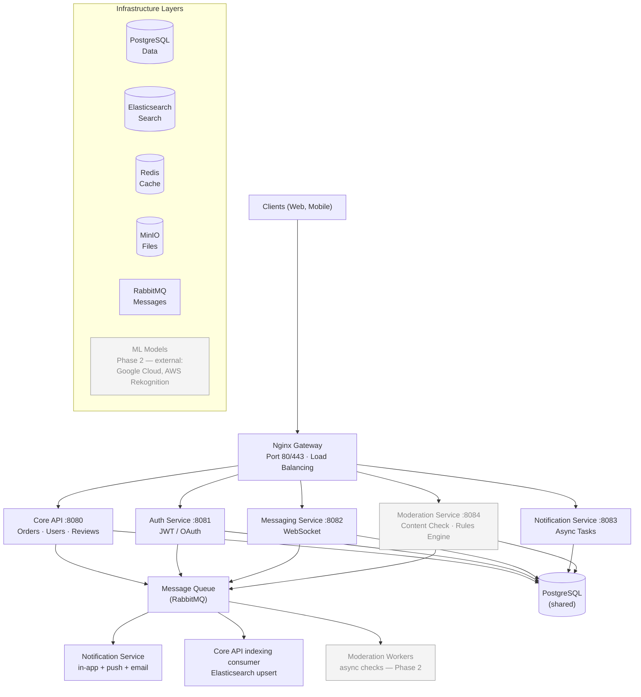

# ProFinder — System Design

- **Version:** 1.4
- **Date:** 2026-09-10
- **Status:** Approved
- **Purpose:** Service topology, per-service responsibilities, infrastructure, inter-service communication, the RabbitMQ exchange/queue layout, and deployment/scaling.

---

## High-Level Architecture
---



> **MVP note:** `Moderation Workers` and the external `ML Models` box are **Phase 2**. In the MVP,
> moderation of user content is manual and reactive (report-triggered) — see
> [4 - Business logic.md § Moderation & Reports](4%20-%20Business%20logic.md#moderation--reports) and
> the *Moderation Service — Phase 2 (not MVP)* section below.

## Core Components
---

### 1. Nginx Gateway (Port 80/443)
---

**Purpose:** Entry point for all clients
**Responsibilities:** HTTP/HTTPS routing, load balancing, SSL termination, rate limiting

### 2. Core API - Quarkus (Port 8080)
---

**Purpose:** Main business logic
**Responsibilities:**
- Users, Orders, Responses, Reviews
- **Reports System** - user/professional reporting for policy violations
- Search (via Elasticsearch)

**Tech:** Java 21, Quarkus 3.x, REST API

**Key Features:**
- Order Lifecycle: DRAFT → ACTIVE → CLOSED (final — no delete, no reopening). Optimistic locking (`version` column).
- One editable response per professional per order (sealed bids); open communication with multiple professionals on same ACTIVE order
- Direct messaging between customer and professionals
- Manual order closing by customer; customer ban/suspend/delete auto-closes their ACTIVE orders
- Review posting anytime, **fully decoupled from orders** (one review per professional, editable)
- Rating stored denormalized (`rating_avg`/`review_count`), recalculated synchronously on review write
- Account soft-deletion (PII scrub, 30-day grace)
- Report submission (independent of orders); moderator warn / suspend / ban (appealable) + reactive content removal
- **Transactional outbox** for all RabbitMQ events (event row written in the same DB transaction, background poller publishes)
- Elasticsearch indexing consumer (event-driven upsert + nightly full reindex)

**Note:**
- Moderation (content filtering) is delegated to Moderation Service for async processing
- Reports (user violations) are handled within Core API with moderator dashboard

### 3. Auth Service - Quarkus (Port 8081)
---

**Purpose:** Centralized authentication & authorization
**Responsibilities:** Registration, email verification (24h link), JWT access tokens (15 min, role + account_status claims), sliding refresh tokens (7d, rotation + reuse detection, 30d cap), OAuth2 (Google, 1:1 link), password reset (15 min link). Maintains the Redis session denylist (`v1:denylist:{user_id}`) for instant revocation on ban / role change / password change / logout-all. Publishes `auth.*` events (verification / password-reset / set-password links) via its own transactional outbox — Notification Service sends the actual email ([9 - Event Catalog.md](9%20-%20Event%20Catalog.md)).
**Tech:** Java 21, Quarkus 3.x
**Not in MVP:** 2FA/TOTP (deferred to Phase 2).

### 4. Messaging Service - Quarkus (Port 8082)
---

**Purpose:** Real-time messaging between users
**Responsibilities:** Send/receive messages, message history, message deletion (own messages), file sharing in messages, WebSocket support. Publishes `message.sent` / `message.deleted` via a transactional outbox.
**Tech:** Java 21, Quarkus 3.x, WebSocket
**Database:** PostgreSQL (shared)

### 5. Notification Service - Quarkus (Port 8083)
---

**Purpose:** Asynchronous notification delivery
**Responsibilities:**
- Push via **Firebase Cloud Messaging** (device-token table, refresh + invalidation)
- Email: real-time per event, `multipart/alternative` (HTML + text), branded Qute templates, per-type + global unsubscribe. No digest in MVP. Also owns the Auth Service transactional emails (`auth.*` events → verification / reset / set-password), which are email-only and bypass the preferences matrix.
- In-app: rows in `notifications` (PostgreSQL), unread badge, purge read > 90d
- Honours the `notification_preferences(user_id, event_type, channel)` matrix
- Idempotent consumers (dedup by `event_id`); failed email → NACK, 3 retries, then `notifications.deadletter`. In-app is written first, so a failed push/email never loses the in-app record.
**Tech:** Java 21, Quarkus 3.x, RabbitMQ consumer
**Database:** PostgreSQL (shared)

### 5a. Moderation Service - Quarkus (Port 8084)
---

**MVP Note:** For the current MVP, moderation of reviews, messages, and portfolio photos is **manual and reactive only** — content publishes immediately and a moderator only looks at it if a user files a report. The sync/async automated pipeline (spam filters, ML toxicity, image classification) described below is the target architecture for a **later phase**, not active MVP behavior. There is also no professional verification/"Verified badge" system — it was explicitly removed from scope.

**Purpose:** Content moderation and validation
**Responsibilities:**
- **Sync Checks** (< 200ms, blocking): Spam filter, profanity detection, URL validation, duplicate detection
- **Async Checks** (via RabbitMQ): ML-based toxicity scoring, image classification, fraud detection
- Rules engine for content validation
- Integration with external ML models (Google Cloud Perspective API, AWS Rekognition)
**Tech:** Java 21, Quarkus 3.x, Message Queue consumer/producer
**Message Queue:** Consumes content events from RabbitMQ; publishes results via callback
**Database:** PostgreSQL (shared) - stores moderation rules, decisions, logs
**External APIs:** Google Cloud Content Safety, AWS Rekognition, custom ML models
**Key Features:**
- Rules can be updated without service restart
- Configurable confidence thresholds per check type
- A/B testing support for different moderation algorithms
- Comprehensive logging and metrics for audit trail

### 6. PostgreSQL (Port 5432)
---

**Purpose:** Main database for all services
**Shared by:** Core API, Auth Service, Messaging Service, Notification Service

### 7. Elasticsearch (Port 9200)
---

**Purpose:** Fast search and filtering
**Integration:** Core API indexes professionals and orders, queries for search results

### 8. Redis (Port 6379)
---

**Purpose:** In-memory cache
**Use Cases:** Session denylist (`v1:denylist:{user_id}`, 900s), Profiles (`v1:profile:*`, 30 min TTL + delete-on-write), Search result pages (`v1:search:*`, 60s TTL, no invalidation), Rate-limit counters, login-fail counters, consumer dedup sets, WebSocket state. **Not cached:** ratings (denormalized column), messages, notification lists, reports.

### 9. MinIO (Port 9000)
---

**Purpose:** S3-compatible file storage
**Files:** Professional photos, portfolio images, review evidence, avatars, message attachments

### 10. RabbitMQ (Port 5672, Management UI 15672)
---

**Purpose:** Message broker for async task processing
**Producers:** Core API, Messaging Service, Auth Service (all via a transactional outbox)
**Consumers:** Notification Service (notifications), Core API (Elasticsearch indexing)
**Exchange:** `profinder.events` (durable topic)
**Queues:**
- `orders.notifications` - order + response events
- `messages.notifications` - message events
- `reviews.notifications` - review events
- `reports.notifications` - report / moderation / account / block events
- `auth.notifications` - Auth Service transactional emails (verification, password reset, set-password)
- `search.index` - Elasticsearch upsert events
- `notifications.deadletter` - failed notification messages (after 3 retries)

> **Full contract:** [9 - Event Catalog.md](9%20-%20Event%20Catalog.md) — every event's routing key, producer, consumers, and JSON payload schema.

**Key Features:**
- Reliable message delivery (acknowledgments) + message persistence
- Transactional outbox on the producer side — broker downtime never fails a business operation
- Idempotent consumers (dedup by `event_id` in `processed_events`)
- Dead Letter Exchange `profinder.dlx` → shared `notifications.deadletter`
- Simple web UI for management

## Service Communication
---

### Core API ↔ Auth Service
---

- **JWT validation is local — no per-request call to Auth Service.** Core API (and every other service) verifies the access-token signature in-process using the Auth Service public key (JWKS cached in memory, refreshed periodically) and reads `role` / `account_status` from the claims. See [10 - Sequence Diagrams.md § A3](10%20-%20Sequence%20Diagrams.md) and [4 - Business logic.md § Sessions & Tokens](4%20-%20Business%20logic.md#sessions--tokens).
- **The only per-request hop is Redis:** one `GET v1:denylist:{user_id}` for instant revocation (ban / suspend / role change / password change / logout-all set the key, TTL 900 s > the 15-min token lifetime).
- **HTTP to Auth Service** is used only for the auth operations themselves (login, refresh, OAuth, etc.), initiated by the client through the LB — not by Core API on the request path.

### Core API → Messaging Service
---

- **Protocol:** HTTP (REST API)
- **Flow:** Retrieve message history, store new messages
- **Use Cases:** Get chat history for order, send messages

### Core API → Elasticsearch
---

- **Protocol:** HTTP via Elasticsearch client
- **Flow:** Index professionals when profile changes, query for search results

### Core API → MinIO
---

- **Protocol:** S3 API via MinIO SDK
- **Flow:** Upload files (photos, portfolio), get public URLs, store URLs in PostgreSQL

### Core API ↔ Redis
---

- **Protocol:** Redis protocol via Jedis client
- **Flow:** Cache sessions, profiles, search results with TTL

### Producers → RabbitMQ (Message Publishers)
---

- **Protocol:** AMQP (Advanced Message Queuing Protocol)
- **Exchange:** `profinder.events` (durable topic exchange)
- **Publishing is via the transactional outbox:** the event row is written in the same DB transaction as the business change; a background poller (`@Scheduled`, ~1s) reads unsent rows, publishes to RabbitMQ, marks them sent. Broker downtime never fails the business operation and never loses an event. Each of Core API, Messaging Service, and Auth Service runs its own outbox + poller.
- **Routing keys** are `<aggregate>.<event>`, singular (`order.published`, `review.posted`, …). Binding patterns are therefore `order.*`, `review.*`, `message.*`, `report.*`, `moderation.*`, `account.*`, `user.*`, `auth.*`, `search.*`.
  - Core API: `order.*`, `response.*`, `review.*`, `report.*`, `moderation.*`, `account.*`, `user.*`, `search.professional_reindex`, `search.order_reindex`
  - Messaging Service: `message.sent`, `message.deleted`
  - Auth Service: `auth.verification_requested`, `auth.password_reset_requested`, `auth.password_set_requested`
  - *Automated content-moderation routing keys are Phase 2 (MVP moderation is manual & reactive).*

**Message Format:** the standard envelope in [9 - Event Catalog.md § 2](9%20-%20Event%20Catalog.md) — `event_id` (consumer idempotency), `event_type`, `event_version`, `occurred_at`, `aggregate_type`/`aggregate_id`, `producer`, `payload`. Full per-event payload schemas are in that file.

### Core API ↔ Moderation Service (Content Validation)
---

- **Sync Calls (Blocking):** HTTP POST `/moderation/check-text`, `/moderation/check-url`
- **Use Cases:** Pre-validation before storing (reviews, messages, user profiles)
- **Response Time:** < 200ms (basic regex, dictionary checks only)
- **Failure Handling:** If sync check fails → return 400 to client, content rejected immediately

- **Async Calls (Non-Blocking):** Publish event to RabbitMQ `moderation.*` queue
- **Workflow:**
  1. Core API stores content (e.g., review) immediately
  2. Publishes moderation event to RabbitMQ
  3. Moderation Service consumes asynchronously
  4. Calls back Core API: POST `/reviews/{id}/moderation-result`
  5. Updates content status (approved/flagged/rejected)
- **Response Time:** 1-5 seconds (ML models, image analysis)

### Notification Service ← RabbitMQ (Message Consumer)
---

- **Protocol:** AMQP
- **Queues Subscribed:** `orders.notifications`, `messages.notifications`, `reviews.notifications`, `reports.notifications`, `auth.notifications`
- **Responsibilities:**
  - Consume messages from queues
  - Send push notifications (Firebase)
  - Send emails (SMTP)
  - Store in-app notifications in PostgreSQL
  - Acknowledge messages (mark as processed)
  - Redeliver to Dead Letter Queue on failure

### Messaging Service ↔ Clients (WebSocket)
---

- **Protocol:** WebSocket over HTTPS
- **Flow:** Real-time message updates, connected clients receive instant messages
- **Fallback:** HTTP polling if WebSocket unavailable

## Key Architecture Decisions
---

| Decision | Rationale |
|----------|-----------|
| **Core API (Orders, Users, Reviews, Responses)** | Focus on business logic; keep core flow fast (<100ms) |
| **Moderation Service separate** | Async content checks (ML, image analysis); prevents blocking Core API; independent scaling; rules updated without redeploy |
| **Moderation: Sync + Async pattern** | Quick sync checks (spam, profanity) for immediate feedback; async checks (ML, Rekognition) run in background via RabbitMQ |
| **Auth Service separate** | Centralized security, independent scalability, used by all services |
| **Messaging Service separate** | WebSocket support, real-time requirements, independent from order flow |
| **Notification Service separate** | Async processing, independent scaling, decoupled from Core API |
| **Single PostgreSQL** | All services share (simpler consistency), can split later if needed |
| **Elasticsearch integration** | Fast search without separate service; Core API indexes and queries |
| **MinIO for files** | Separates large files from database; easy migration to AWS S3 |
| **Redis caching** | Reduces database load; sessions, profiles, search results |
| **Nginx Gateway** | Single entry point for routing, load balancing, SSL termination |
| **RabbitMQ** | AMQP message broker; reliable delivery, transactional outbox, simple management |

## RabbitMQ Queues & Exchanges
---

> Authoritative version, with per-event payload schemas: [9 - Event Catalog.md § 3](9%20-%20Event%20Catalog.md).

**Exchanges:**
- `profinder.events` - durable topic exchange, all domain events
- `profinder.dlx` - dead-letter exchange → `notifications.deadletter`

**Queues:**

| Queue | Bindings (routing keys) | Purpose | Consumer |
|-------|-------------------|---------|----------|
| `orders.notifications` | `order.*`, `response.*` | Order + response events | Notification Service |
| `messages.notifications` | `message.*` | Message events | Notification Service |
| `reviews.notifications` | `review.*` | Review events | Notification Service |
| `reports.notifications` | `report.*`, `moderation.*`, `account.*`, `user.*` | Report / moderation / account / block events | Notification Service |
| `auth.notifications` | `auth.*` | Auth transactional emails (verification, reset, set-password) | Notification Service |
| `search.index` | `search.*` | Elasticsearch upsert (`search.professional_reindex`, `search.order_reindex`) | Core API indexing consumer |
| `notifications.deadletter` | (dead-lettered only) | Failed notification messages (after 3 retries) | Manual retry |
| `reviews.moderation` / `messages.moderation` / `users.moderation` / `moderation.deadletter` | — | Automated content moderation | **Phase 2** — MVP moderation is manual & reactive |

**Key Configuration:**
- Message TTL: 24 h on the `*.notifications` queues; **none** on `search.index` (reindex events must survive an ES outage > 24 h — nightly full reindex is the backstop)
- Max retries: 3 → `notifications.deadletter`
- Dead Letter Exchange: `profinder.dlx`


## Moderation Service — Phase 2 (not MVP)
---

> **Not built for the MVP.** MVP moderation is manual and reactive: user content publishes immediately
> and a moderator only reviews it if someone files a report ([4 - Business logic.md § Moderation & Reports](4%20-%20Business%20logic.md#moderation--reports)).
> The only real MVP surface of this service is the synchronous `check-text` / `check-url` endpoints
> ([8 - API Specification.md § Moderation Service](8%20-%20API%20Specification.md)). Everything below is the
> **target architecture for a later phase**, kept here so the design intent is on record.

### Sync Checks (Fast Path, Blocking)
---

Executed immediately when content is submitted. Must complete in < 200ms.

**Checks Performed:**
1. **Spam Filter** - Regex-based spam word detection
2. **Profanity Filter** - Dictionary-based profanity detection
3. **URL Validation** - Detect suspicious/phishing URLs
4. **Rate Limiting** - Detect user spamming (same content repeated)

**Request/Response Example:**
```text
POST /moderation/check-text
{
  "text": "Check out my review...",
  "type": "review",
  "user_id": "123"
}

Response (< 50ms):
{
  "approved": true,
  "checks_passed": ["spam", "profanity", "url", "rate_limit"],
  "score": 0.95
}
```

### Async Checks (Slow Path, Non-Blocking)
---

Executed in background after content is stored. Runs via RabbitMQ workers.

**Checks Performed:**
1. **ML Toxicity Scoring** - Google Cloud Perspective API (800-1000ms)
2. **Image Classification** - AWS Rekognition (1-3s per image)
3. **Fraud Detection** - Behavioral analysis, IP checking (200-500ms)
4. **Deep Content Analysis** - Custom ML models (1-2s)

**Workflow:**
```text
1. User creates review with photo
   POST /reviews → Core API
   
2. Core API:
   - Saves review to DB
   - Calls sync checks → Moderation Service
   - Returns 201 Created immediately
   - Publishes event: reviews.moderation

3. RabbitMQ routes to Moderation Service workers

4. Moderation Workers:
   - Run ML toxicity check (800ms)
   - Analyze image with Rekognition (2s)
   - Run fraud checks (500ms)
   - Aggregate results
   
5. Callback to Core API:
   POST /reviews/123/moderation-result
   {
     "moderation_id": "mod_456",
     "approved": true/false/flagged,
     "confidence": 0.92,
     "reason": "...",
     "action": "approve|flag_review|reject|request_human"
   }

6. Core API updates review status:
   - approved: visible immediately
   - flagged: needs human review
   - rejected: hidden, notify user
```

### Moderation Rules (Configurable, No Redeploy)
---

Rules stored in PostgreSQL or YAML config. Can be updated without restarting service.

```yaml
moderation_rules:
  sync_checks:
    spam_words:
      enabled: true
      action: reject
      words:
        - viagra
        - casino
        - lottery
        
    profanity:
      enabled: true
      action: flag
      dictionary_version: v2
      
    url_validation:
      enabled: true
      action: reject
      blocklist:
        - phishing.com
        - malware-site.net
        
  async_checks:
    ml_toxicity:
      enabled: true
      model: google_perspective
      confidence_threshold: 0.75
      action: flag
      
    image_classification:
      enabled: true
      model: aws_rekognition
      confidence_threshold: 0.80
      prohibited_labels:
        - EXPLICIT
        - VIOLENCE
        - HATE_SPEECH
      action: reject
      
    fraud_detection:
      enabled: true
      blacklist_ips: true
      check_velocity: true
      max_posts_per_hour: 10
```

### Metrics & Analytics
---

```text
GET /moderation/analytics
{
  "period": "2026-08-01 to 2026-08-16",
  "total_checks": 15420,
  "sync_checks": 15400,
  "async_checks": 15420,
  "results": {
    "auto_approved": 14200,
    "flagged_for_review": 840,
    "auto_rejected": 340,
    "pending_human_review": 40
  },
  "false_positives": 25,
  "false_negatives": 8,
  "avg_processing_time_ms": 2100,
  "ml_model_accuracy": 0.94,
  "by_check_type": {
    "spam_filter": { "triggered": 120, "accuracy": 0.98 },
    "ml_toxicity": { "triggered": 340, "accuracy": 0.89 },
    "image_classification": { "triggered": 180, "accuracy": 0.95 },
    "fraud_detection": { "triggered": 25, "accuracy": 0.92 }
  }
}
```


## Deployment & Scaling
---

**Initial Launch:** Docker Compose on single VPS with:
- Core API (1 instance)
- Auth Service (1 instance)
- Messaging Service (1 instance)
- Notification Service (1 instance)
- Moderation Service (1-2 instances for async workers)
- RabbitMQ (1 instance, management UI enabled)
- PostgreSQL (single instance)
- Elasticsearch, Redis, MinIO (single instances)

**As it grows:** Kubernetes cluster with:
- **Core API:** 2-5 replicas (auto-scale on CPU/memory)
- **Moderation Service:** 3-10 replicas (auto-scale on RabbitMQ queue depth)
  - Sync check replicas: 2-3 (low traffic, fast)
  - Async check replicas: 5-10 (high load, slow operations)
- **Other services:** 2-3 replicas each
- RabbitMQ cluster (3+ nodes with Erlang clustering)
- PostgreSQL replicas (read replicas for scaling reads)
- Auto-scaling based on queue depth and latency metrics
- Dedicated node pools for compute-heavy services (Moderation for ML models)

---

## Changelog
---

| Version | Date | Change |
|---|---|---|
| 1.4 | 2026-09-10 | Standardised to the shared doc format. Title "System Architecture" → "System Design" (matches the filename and every cross-reference). Moved the header version-note prose into this table. Renamed *Moderation Service Details* → *Moderation Service — Phase 2 (not MVP)* and added an MVP callout on the high-level diagram's Phase-2 boxes. |
| 1.3 | 2026-09-07 | "Core API ↔ Auth Service" now says JWT validation is **local** (signature check + Redis denylist), not a per-request HTTP call — matches [4 - Business logic.md § Sessions & Tokens](4%20-%20Business%20logic.md#sessions--tokens) and [10 - Sequence Diagrams.md § A3](10%20-%20Sequence%20Diagrams.md). Closed the last cross-file inconsistency. |
| 1.2 | 2026-09-07 | Reconciled the RabbitMQ routing scheme with [9 - Event Catalog.md](9%20-%20Event%20Catalog.md): singular `<aggregate>.<event>` routing keys with `<aggregate>.*` bindings; reindex events renamed `search.professional_reindex` / `search.order_reindex`; added `user.*` / `auth.*` bindings; removed the stale `email.queue` / "Email Worker"; Auth Service and Messaging Service added as event producers; exchange named `profinder.events`. |
| 1.1 | 2026-09-07 | Synced service responsibilities with [4 - Business logic.md](4%20-%20Business%20logic.md). |
| 1.0 | earlier | Initial architecture: 5 services, shared PostgreSQL, Redis/Elasticsearch/MinIO/RabbitMQ, Nginx gateway. |
