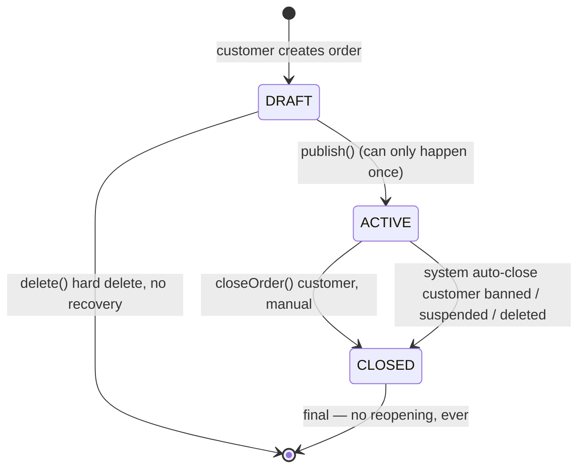
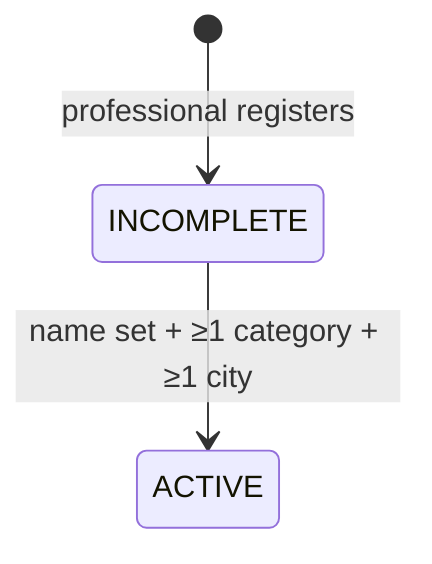
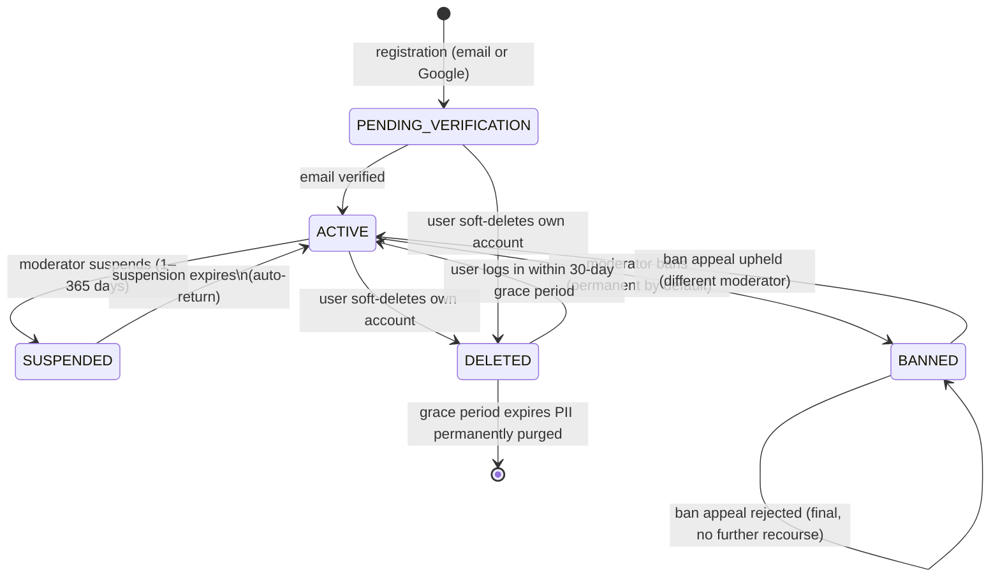
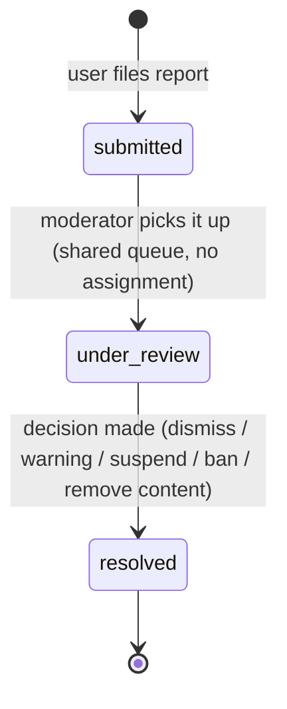
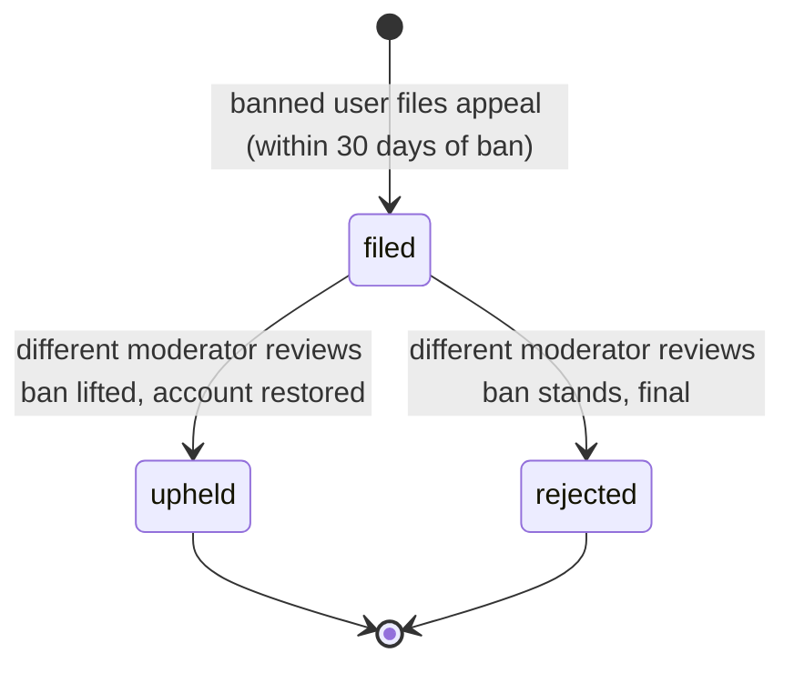
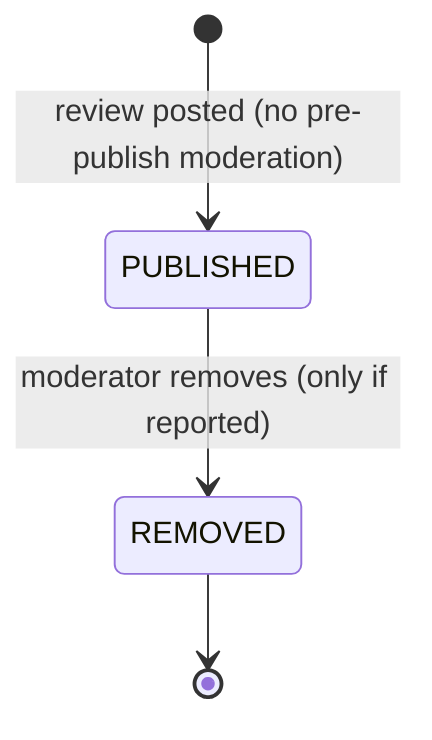

# ProFinder — State Machines

**Version:** 1.1
**Date:** 2026-09-10
**Status:** Stable
**Purpose:** Mermaid `stateDiagram-v2` state machines for every entity that has one — Order, Professional Profile, Account, Report, Ban Appeal, Review.

Most logic here was already decided prose in [4 - Business logic.md](4%20-%20Business%20logic.md) and [2 - Requirements.md](2%20-%20Requirements.md); two gaps found while diagramming (professional profile category/city floor, `PENDING_VERIFICATION` ban/suspend) were decided on 2026-09-04 and folded back into file 4. Referenced from [Documentation Roadmap.md](Documentation%20Roadmap.md) (Block C, "State" row).

---

## 1. Order
---

Full lifecycle described in [4 - Business logic.md § Order Lifecycle](4%20-%20Business%20logic.md#order-lifecycle) and [§ State Transitions](4%20-%20Business%20logic.md#state-transitions).

**Notes:**
- No soft-delete, no DELETED status — see [Decisions Made (Orders)](4%20-%20Business%20logic.md#decisions-made-orders).
- Expiration (`expires_at`) does **not** change status — an expired order stays `ACTIVE` but drops out of professional search results until extended or closed.

## 2. Professional Profile
---

Described in [4 - Business logic.md § Professional Profile](4%20-%20Business%20logic.md#professional-profile) and [FR-Profile-P5](2%20-%20Requirements.md).

**Decided (2026-09-04):** `ACTIVE` is sticky — there is no reverse transition. A professional can never drop below 1 category or 1 city: the API only allows **replacing** the last remaining category/city (swap), not clearing it to zero. So a profile that reached `ACTIVE` cannot fall back to `INCOMPLETE` through editing. See [4 - Business logic.md § Professional Profile](4%20-%20Business%20logic.md#professional-profile).

## 3. Account Status
---

Consolidated from three separate sections that each define one piece of this machine — [Authentication § Email Registration](4%20-%20Business%20logic.md#email-registration) (`PENDING_VERIFICATION`), [Report System § Decision & Action](4%20-%20Business%20logic.md#decision--action) (`SUSPENDED` / `BANNED`), and [Account Deletion](4%20-%20Business%20logic.md#account-deletion) (`DELETED`). This diagram is the first place all of it is drawn as one machine.

**Notes / decisions:**
- A user **cannot** self-delete while `SUSPENDED` or `BANNED`, or with an open report against them — so there is deliberately no `SUSPENDED → DELETED` or `BANNED → DELETED` edge (see [Account Deletion](4%20-%20Business%20logic.md#account-deletion)).
- **Decided (2026-09-04):** a `PENDING_VERIFICATION` account **cannot** be suspended or banned. Moderation action requires the account to be email-verified (`ACTIVE`) first — there is deliberately no `PENDING_VERIFICATION → SUSPENDED` or `PENDING_VERIFICATION → BANNED` edge. A report against an unverified user can still be filed and reviewed; the moderator just can't act on it with suspend/ban until the account verifies.
- JWT `account_status` claim (see [FR-Auth-5](2%20-%20Requirements.md)) is presumably one of these exact values — worth confirming when the DB schema/enum is defined.

## 4. Report
---

Workflow described in [4 - Business logic.md § Report Workflow](4%20-%20Business%20logic.md#report-workflow).

## 5. Ban Appeal
---

Described in [4 - Business logic.md § Ban Appeals](4%20-%20Business%20logic.md#ban-appeals). Only bans are appealable — warnings, suspensions, and dismissed reports have no appeal flow.

**Note:** one appeal per ban — there is no appeal of the appeal (see [4 - Business logic.md § Ban Appeals](4%20-%20Business%20logic.md#ban-appeals)).

## 6. Review (Moderation)
---

Described in [4 - Business logic.md § Reviews](4%20-%20Business%20logic.md#reviews) and [§ Moderation & Reports](4%20-%20Business%20logic.md#moderation--reports). No formal states are named in prose — this is the simplest machine in the system: reactive-only moderation, published immediately, removed only if reported.

**Note:** same machine applies to professional replies to reviews and to portfolio photos (see [Portfolio Management](4%20-%20Business%20logic.md#portfolio-management)) — all three content types share this identical reactive-moderation shape.

## Summary Table
---

| Entity | States | Terminal? | Source |
|---|---|---|---|
| Order | DRAFT, ACTIVE, CLOSED | CLOSED is terminal | [4 - Business logic.md](4%20-%20Business%20logic.md#order-lifecycle) |
| Professional Profile | INCOMPLETE, ACTIVE | No terminal state | [4 - Business logic.md](4%20-%20Business%20logic.md#professional-profile) |
| Account | PENDING_VERIFICATION, ACTIVE, SUSPENDED, BANNED, DELETED | DELETED → purge is terminal | consolidated, see above |
| Report | submitted, under_review, resolved | resolved is terminal | [4 - Business logic.md](4%20-%20Business%20logic.md#report-workflow) |
| Ban Appeal | filed, upheld, rejected | both outcomes terminal | [4 - Business logic.md](4%20-%20Business%20logic.md#ban-appeals) |
| Review / Reply / Portfolio Photo | PUBLISHED, REMOVED | REMOVED is terminal | [4 - Business logic.md](4%20-%20Business%20logic.md#reviews) |

## Changelog
---

| Version | Date | Change |
|---|---|---|
| 1.1 | 2026-09-10 | Standardised to the shared doc format (metadata block, separators, changelog). Removed the stale "Next" section (Database Schema is done — [6 - Database Schema.md](6%20-%20Database%20Schema.md)). |
| 1.0 | 2026-09-04 | Initial. Mermaid state machines for Order, Professional Profile, Account (consolidated from 3 scattered sections), Report, Ban Appeal, Review moderation; two gaps found and folded into [4 - Business logic.md](4%20-%20Business%20logic.md). |
