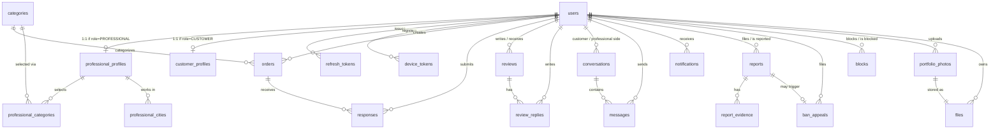
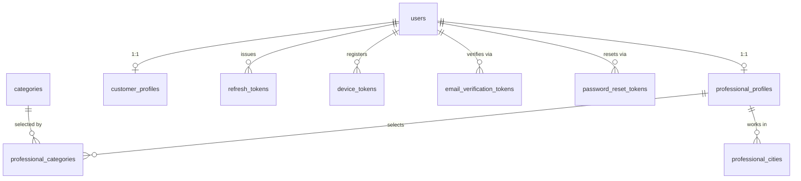
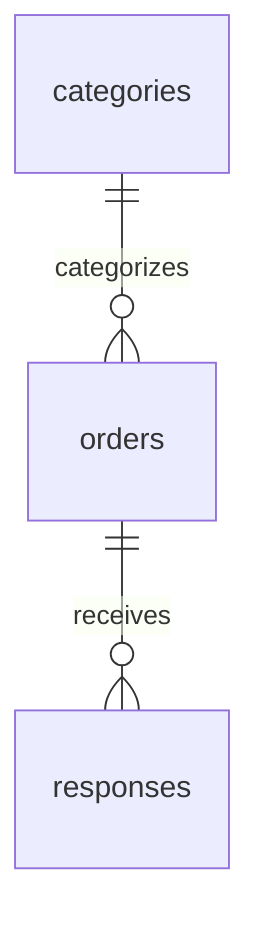
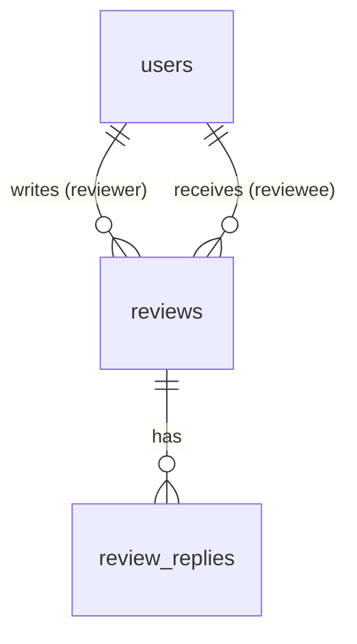
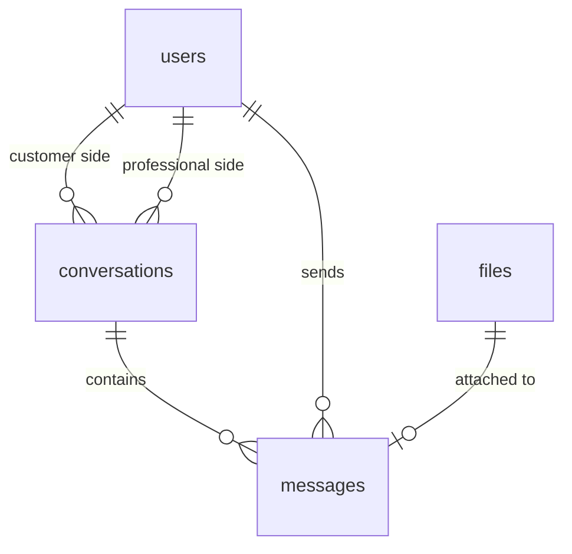
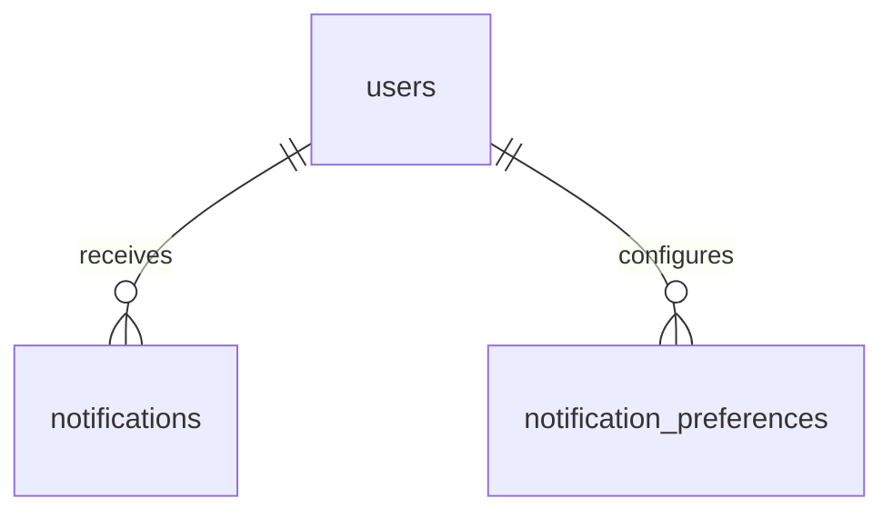
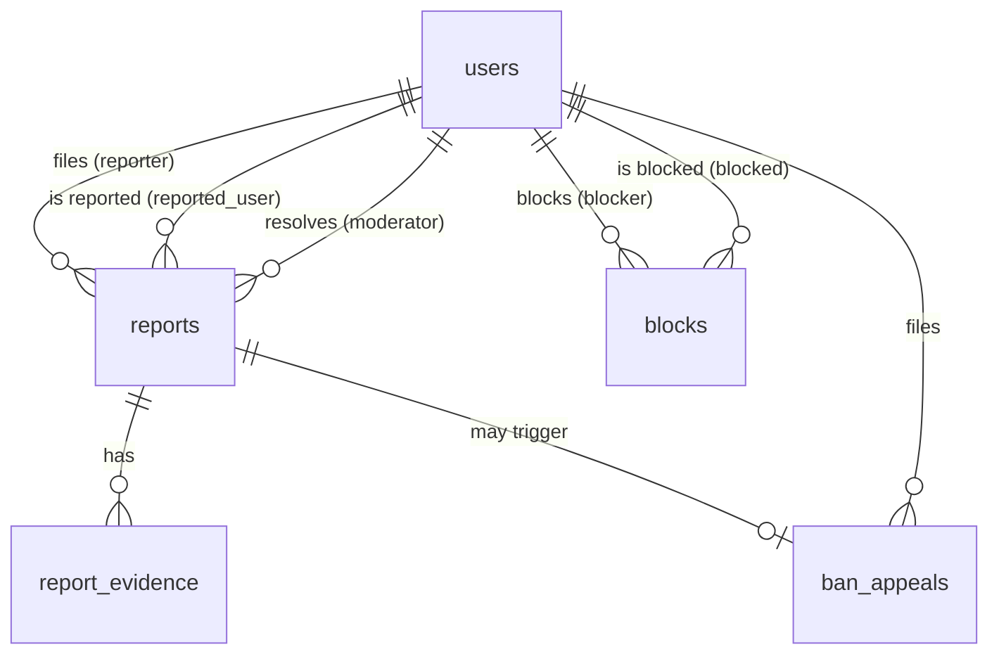
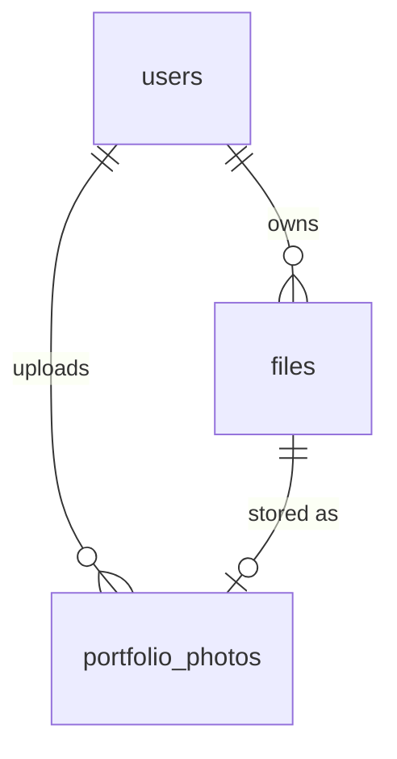

# ProFinder — Database Schema

- **Version:** 1.3
- **Date:** 2026-09-10
- **Status:** Stable
- **Purpose:** Full relational schema — tables, columns, types, constraints, indexes, enums. Every decision here traces back to [4 - Business logic.md](4%20-%20Business%20logic.md) and [5 - State Machines.md](5%20-%20State%20Machines.md); no new business decisions are made in this file, only translated into DDL-shaped tables.

Referenced from [Documentation Roadmap.md](Documentation%20Roadmap.md) (Block B, Tier 1 — "Database Schema / ERD").

**Format:** diagrams show **relationships only** (entity names + cardinality, no columns) — columns live in plain markdown tables right below each diagram. Packing full column lists into Mermaid ER attribute blocks got unreadable fast; this way the diagram stays a quick map and the columns stay easy to scan/copy as text.

**A few tables beyond the original roadmap checklist**, needed once the columns were actually worked out — noted here so it's clear they're refinements, not scope creep:
- `professional_categories` / `professional_cities` — join tables for the professional's many-to-many category/city selections (roadmap only named the parent tables).
- `ban_appeals` — [5 - State Machines.md § Ban Appeal](5%20-%20State%20Machines.md) has its own lifecycle (filed/upheld/rejected); it needs its own row, it can't live inside `reports`.
- `files` — one polymorphic table instead of separate "files/attachments" per feature (avatar, portfolio, review evidence, report evidence, message attachment) — same shape every time, so one table with an `attached_to_type`/`attached_to_id` pair.

---

## Overview
---

## 1. Users & Auth
---

Source: [4 - Business logic.md § Authentication & Registration](4%20-%20Business%20logic.md#authentication--registration), [§ Professional Profile](4%20-%20Business%20logic.md#professional-profile), [§ Sessions & Tokens](4%20-%20Business%20logic.md#sessions--tokens), [5 - State Machines.md § Account Status](5%20-%20State%20Machines.md).

#### `users`
---

| Column | Type | Constraints / Notes |
|---|---|---|
| id | uuid | PK |
| email | string | UNIQUE, case-insensitive, normalized |
| password_hash | string | nullable — Google-only users |
| google_id | string | UNIQUE, nullable — strict 1:1 link |
| role | user_role | NOT NULL |
| status | account_status | NOT NULL, DEFAULT `PENDING_VERIFICATION` |
| moderator_level | moderator_level | nullable — only for `role = MODERATOR` |
| display_name | string(50) | NOT NULL; **2–50 chars**, letters/digits/marks/spaces/`.` `'` `-`, no URLs |
| phone | string(20) | nullable; E.164 format |
| bio | text(2000) | nullable; ≤ 2000 chars |
| avatar_file_id | uuid | FK → `files.id`, nullable |
| suspension_end_date | timestamp | nullable |
| ban_reason | text | nullable |
| deleted_at | timestamp | nullable — soft delete / PII scrub marker |
| version | int | optimistic locking |
| created_at | timestamp | |
| updated_at | timestamp | |

#### `professional_profiles`
---

| Column | Type | Constraints / Notes |
|---|---|---|
| user_id | uuid | PK, FK → `users.id` |
| profile_status | profile_status | NOT NULL, DEFAULT `INCOMPLETE` |
| years_experience | int | nullable; **CHECK (years_experience BETWEEN 0 AND 70)**; no `date_of_birth` field in MVP |
| hourly_rate | numeric(10,2) | nullable, USD; **CHECK (hourly_rate >= 0 AND hourly_rate <= 100000)** |
| available | boolean | NOT NULL — manual toggle |
| working_hours_start | time | nullable |
| working_hours_end | time | nullable |
| rating_avg | numeric(3,2) | denormalized, DEFAULT 0 |
| review_count | int | denormalized, DEFAULT 0 |
| version | int | optimistic locking |
| created_at | timestamp | |
| updated_at | timestamp | |

#### `customer_profiles`
---

| Column | Type | Constraints / Notes |
|---|---|---|
| user_id | uuid | PK, FK → `users.id` |
| city | string(100) | nullable; ≤ 100 chars |
| preferred_category_ids | jsonb | nullable — frontend hint only, no backend logic depends on it |
| reliability_rating_avg | numeric(3,2) | denormalized, DEFAULT 0 |
| reliability_review_count | int | denormalized, DEFAULT 0 |
| created_at | timestamp | |
| updated_at | timestamp | |

#### `professional_categories`
---

| Column | Type | Constraints / Notes |
|---|---|---|
| professional_id | uuid | PK, FK → `professional_profiles.user_id` |
| category_id | uuid | PK, FK → `categories.id` |

#### `professional_cities`
---

| Column | Type | Constraints / Notes |
|---|---|---|
| professional_id | uuid | PK, FK → `professional_profiles.user_id` |
| city | string(100) | PK; ≤ 100 chars; case-insensitive dedupe |

#### `refresh_tokens`
---

| Column | Type | Constraints / Notes |
|---|---|---|
| id | uuid | PK |
| user_id | uuid | FK → `users.id` |
| token_hash | string | |
| family_id | uuid | rotation / reuse-detection group |
| issued_at | timestamp | |
| expires_at | timestamp | |
| rotated_at | timestamp | nullable |
| revoked | boolean | DEFAULT false |

#### `device_tokens`
---

| Column | Type | Constraints / Notes |
|---|---|---|
| id | uuid | PK |
| user_id | uuid | FK → `users.id` |
| token | string | UNIQUE |
| platform | string | `ios` \| `android` \| `web` |
| created_at | timestamp | |
| last_seen_at | timestamp | |

#### `email_verification_tokens`
---

| Column | Type | Constraints / Notes |
|---|---|---|
| id | uuid | PK |
| user_id | uuid | FK → `users.id` |
| token_hash | string | UNIQUE; the emailed token is stored only as a hash |
| expires_at | timestamp | 24 h from issue (`email_verification_ttl`, configurable) |
| used_at | timestamp | nullable — single-use |
| created_at | timestamp | |

At most one **active** (unused, unexpired) row per user — issuing a new link invalidates the previous one ([4 - Business logic.md § Email Registration](4%20-%20Business%20logic.md#email-registration)).

#### `password_reset_tokens`
---

| Column | Type | Constraints / Notes |
|---|---|---|
| id | uuid | PK |
| user_id | uuid | FK → `users.id` |
| token_hash | string | UNIQUE; stored as a hash |
| expires_at | timestamp | 15 min from issue (`password_reset_ttl`, configurable) |
| used_at | timestamp | nullable — single-use |
| created_at | timestamp | |

Also used for the Google-only "set a password" flow. At most one active row per user.

**Constraints worth calling out:**
- `professional_categories` / `professional_cities` must have **≥1 row per professional once `profile_status = ACTIVE`** — enforced at the application layer (the "replace, don't clear to zero" rule from [5 - State Machines.md § Professional Profile](5%20-%20State%20Machines.md)).
- `users.role` is immutable in MVP (app-layer check, not a DB constraint — support-only change per FR-Auth-3).
- `users.moderator_level` is null for everyone except `role = MODERATOR`; `SENIOR` is the "Admin" tier decided in [A3](Documentation%20Roadmap.md).

## 2. Orders & Categories
---

Source: [4 - Business logic.md § Order Lifecycle](4%20-%20Business%20logic.md#order-lifecycle), [§ Location and Categories](4%20-%20Business%20logic.md#location-and-categories), [§ Professional Responses](4%20-%20Business%20logic.md#professional-responses).

#### `categories`
---

| Column | Type | Constraints / Notes |
|---|---|---|
| id | uuid | PK |
| name | string(50) | NOT NULL, UNIQUE; **2–50 chars**; case-insensitive unique |
| created_at | timestamp | |
| updated_at | timestamp | |

#### `orders`
---

| Column | Type | Constraints / Notes |
|---|---|---|
| id | uuid | PK |
| customer_id | uuid | FK → `users.id` |
| category_id | uuid | FK → `categories.id` |
| status | order_status | NOT NULL, DEFAULT `DRAFT` |
| title | string(120) | NOT NULL; **5–120 chars** |
| description | text(5000) | NOT NULL; **20–5000 chars** |
| budget_min | numeric(10,2) | nullable, USD; **CHECK (budget_min >= 0)** |
| budget_max | numeric(10,2) | nullable, USD; **CHECK (budget_max >= 0)** |
| location | string(100) | NOT NULL; city; ≤ 100 chars |
| preferred_date | date | nullable; **must be today or later** (application-layer validation) |
| expires_at | timestamp | nullable |
| published_at | timestamp | nullable |
| closed_at | timestamp | nullable |
| closed_reason | string | nullable — `manual` \| `account_action` |
| version | int | optimistic locking |
| created_at | timestamp | |
| updated_at | timestamp | |

#### `responses`
---

| Column | Type | Constraints / Notes |
|---|---|---|
| id | uuid | PK |
| order_id | uuid | FK → `orders.id` |
| professional_id | uuid | FK → `users.id` |
| quote_price | numeric(10,2) | USD; **CHECK (quote_price >= 0 AND quote_price <= 1000000)** |
| message | text(2000) | nullable; ≤ 2000 chars |
| edited | boolean | DEFAULT false |
| created_at | timestamp | |
| updated_at | timestamp | |

**Constraints:**
- `responses`: `UNIQUE (order_id, professional_id)` — one editable response per professional per order ([FR-Responses-1](2%20-%20Requirements.md)).
- `categories`: flat list, **no `parent_id`** — see [A4 decision](Documentation%20Roadmap.md).
- No `latitude`/`longitude`, no `preferred_professional_level` on `orders` — both dropped, see [A5 decision](Documentation%20Roadmap.md).

## 3. Reviews
---

Source: [4 - Business logic.md § Reviews](4%20-%20Business%20logic.md#reviews), [§ Rating and Reputation System](4%20-%20Business%20logic.md#rating-and-reputation-system).

#### `reviews`
---

| Column | Type | Constraints / Notes |
|---|---|---|
| id | uuid | PK |
| reviewer_id | uuid | FK → `users.id` |
| reviewee_id | uuid | FK → `users.id` |
| reviewer_role | review_direction | `CUSTOMER` \| `PROFESSIONAL` |
| rating | smallint | 1–5; **CHECK (rating BETWEEN 1 AND 5)** |
| text | text(2000) | nullable; ≤ 2000 chars; passes sync moderation check |
| is_outlier | boolean | DEFAULT false — brigading filter |
| deleted_at | timestamp | nullable |
| created_at | timestamp | |
| updated_at | timestamp | |

#### `review_replies`
---

| Column | Type | Constraints / Notes |
|---|---|---|
| id | uuid | PK |
| review_id | uuid | FK → `reviews.id` |
| author_id | uuid | FK → `users.id` |
| text | text(2000) | NOT NULL; **1–2000 chars**; only on `CUSTOMER`-direction reviews |
| deleted_at | timestamp | nullable |
| created_at | timestamp | |
| updated_at | timestamp | |

**Constraints:**
- `reviews`: `UNIQUE (reviewer_id, reviewee_id)` — one review per pair, in either direction ([A2 decision](Documentation%20Roadmap.md)).
- `review_replies` only ever attach to a `reviews` row where `reviewer_role = 'CUSTOMER'` (professional replies + customer's own follow-up) — a `PROFESSIONAL`-direction review (customer reliability rating) has **no reply** in MVP. Enforced at the application layer.
- On insert/update/delete of a non-deleted, non-outlier `reviews` row, the corresponding `rating_avg`/`review_count` (on `professional_profiles` or `customer_profiles`, depending on `reviewer_role`) is recalculated **synchronously in the same transaction**.

## 4. Messaging
---

Source: [4 - Business logic.md § Messaging & Communication](4%20-%20Business%20logic.md#messaging--communication), including the [Conversation Model](4%20-%20Business%20logic.md) subsection.

#### `conversations`
---

| Column | Type | Constraints / Notes |
|---|---|---|
| id | uuid | PK |
| customer_id | uuid | FK → `users.id` |
| professional_id | uuid | FK → `users.id` |
| created_at | timestamp | |
| updated_at | timestamp | |

#### `messages`
---

| Column | Type | Constraints / Notes |
|---|---|---|
| id | uuid | PK |
| conversation_id | uuid | FK → `conversations.id` |
| sender_id | uuid | FK → `users.id` |
| text | string | nullable, ≤200 chars |
| attachment_file_id | uuid | FK → `files.id`, nullable |
| status | message_status | `SENT` \| `DELIVERED` \| `READ` |
| deleted_at | timestamp | nullable — purged after grace period |
| created_at | timestamp | |

**Constraints:**
- `conversations`: `UNIQUE (customer_id, professional_id)` — keyed by pair, not by order, per the [Conversation Model](4%20-%20Business%20logic.md) decision (A1). Same conversation is reused across every order between the pair.
- `messages.deleted_at`: UI hides it immediately on set; a background job hard-deletes the row after the short moderator-review grace period ([4 - Business logic.md § History & Retention](4%20-%20Business%20logic.md#history--retention)).

## 5. Notifications
---

Source: [4 - Business logic.md § Notifications](4%20-%20Business%20logic.md#notifications).

#### `notifications`
---

| Column | Type | Constraints / Notes |
|---|---|---|
| id | uuid | PK |
| user_id | uuid | FK → `users.id` |
| type | string | event_type, e.g. `order.published` |
| entity_type | string | nullable |
| entity_id | uuid | nullable |
| title | string | |
| body | text | |
| is_read | boolean | DEFAULT false |
| read_at | timestamp | nullable |
| created_at | timestamp | |

#### `notification_preferences`
---

| Column | Type | Constraints / Notes |
|---|---|---|
| user_id | uuid | PK, FK → `users.id` |
| event_type | string | PK |
| channel | notification_channel | PK — `push` \| `email` \| `in_app` |
| enabled | boolean | DEFAULT true |

**Notes:**
- A background job purges **read** `notifications` older than `inapp_retention_days` (default 90); unread rows are kept indefinitely.
- `notification_preferences` has no row = treated as `enabled = true` (every cell defaults on) — rows only exist for cells a user has actually touched, or the table is pre-seeded per user on signup (implementation choice, not a schema constraint).

## 6. Moderation & Reports
---

Source: [4 - Business logic.md § Report System](4%20-%20Business%20logic.md#report-system-separate-from-order-lifecycle), [§ Ban Appeals](4%20-%20Business%20logic.md#ban-appeals), [5 - State Machines.md § Report](5%20-%20State%20Machines.md) and [§ Ban Appeal](5%20-%20State%20Machines.md).

#### `reports`
---

| Column | Type | Constraints / Notes |
|---|---|---|
| id | uuid | PK |
| reporter_id | uuid | FK → `users.id` |
| reported_user_id | uuid | FK → `users.id` |
| reason | report_reason | NOT NULL |
| description | text(2000) | NOT NULL; **10–2000 chars** |
| status | report_status | NOT NULL, DEFAULT `submitted` |
| moderator_id | uuid | FK → `users.id`, nullable |
| moderator_notes | text(4000) | nullable; ≤ 4000 chars |
| decision | report_decision | nullable |
| suspension_end_date | timestamp | nullable |
| created_at | timestamp | |
| resolved_at | timestamp | nullable |

#### `report_evidence`
---

| Column | Type | Constraints / Notes |
|---|---|---|
| id | uuid | PK |
| report_id | uuid | FK → `reports.id` |
| type | evidence_type | `text` \| `photo` \| `message_link` |
| content | text | url, text, or message reference |
| created_at | timestamp | |

#### `ban_appeals`
---

| Column | Type | Constraints / Notes |
|---|---|---|
| id | uuid | PK |
| user_id | uuid | FK → `users.id` — the banned user |
| report_id | uuid | FK → `reports.id`, UNIQUE — the report that led to the ban |
| text | text(2000) | nullable; ≤ 2000 chars; within 30 days of ban; one per ban |
| reviewer_id | uuid | FK → `users.id`, nullable — must differ from the banning moderator |
| status | appeal_status | NOT NULL, DEFAULT `filed` |
| created_at | timestamp | |
| resolved_at | timestamp | nullable |

#### `blocks`
---

| Column | Type | Constraints / Notes |
|---|---|---|
| id | uuid | PK |
| blocker_id | uuid | FK → `users.id` |
| blocked_id | uuid | FK → `users.id` |
| created_at | timestamp | |

**Constraints:**
- `reports`: no unique constraint on `(reporter_id, reported_user_id)` alone — duplicates are allowed, just rate-limited to 1/day (checked at the application layer against `created_at`, see [FR-Reports-12](2%20-%20Requirements.md)).
- `ban_appeals`: `UNIQUE (report_id)` — one appeal per ban. `reviewer_id` must differ from `reports.moderator_id` (app-layer check).
- **Suspend/ban precondition:** a report's `decision` can only become `suspended`/`banned` if the `reported_user_id`'s `users.status` is currently `ACTIVE` (not `PENDING_VERIFICATION`) — see the gap closed in [5 - State Machines.md § Account Status](5%20-%20State%20Machines.md).
- `blocks`: `UNIQUE (blocker_id, blocked_id)`.

## 7. Files & Portfolio
---

Source: [4 - Business logic.md § Portfolio Management](4%20-%20Business%20logic.md#portfolio-management), [§ File Storage](4%20-%20Business%20logic.md#file-storage).

#### `files`
---

| Column | Type | Constraints / Notes |
|---|---|---|
| id | uuid | PK |
| owner_id | uuid | FK → `users.id` — uploader |
| attached_to_type | string | `user_avatar` \| `portfolio_photo` \| `review_evidence` \| `report_evidence` \| `message` |
| attached_to_id | uuid | nullable — polymorphic target row id |
| storage_key | string | MinIO object key |
| mime_type | string | |
| size_bytes | int | |
| deleted_at | timestamp | nullable |
| created_at | timestamp | |

#### `portfolio_photos`
---

| Column | Type | Constraints / Notes |
|---|---|---|
| id | uuid | PK |
| professional_id | uuid | FK → `users.id` |
| file_id | uuid | FK → `files.id` |
| caption | text(2000) | nullable; ≤ 2000 chars |
| deleted_at | timestamp | nullable — moderator removal |
| created_at | timestamp | |

**Notes:**
- `files` is intentionally polymorphic (`attached_to_type` + `attached_to_id`) instead of five near-identical tables — every purpose shares the same columns (storage key, mime type, size).
- Per-type size limits (avatar 5 MB, portfolio 15 MB, review evidence 10 MB, report evidence 10 MB, message image 10 MB / other 25 MB) are validated at the application layer, not the DB — see [4 - Business logic.md § File Storage](4%20-%20Business%20logic.md#file-storage).
- On delete, the storage object is removed from MinIO immediately; `deleted_at` is the DB-side marker.

## 8. Async / Reliability Infra
---

Source: [4 - Business logic.md § Reliable Event Publishing (Transactional Outbox)](4%20-%20Business%20logic.md#reliable-event-publishing-transactional-outbox).

No FK relationships to business tables by design — events are decoupled via a JSON payload, not a foreign key. (No diagram for this domain — a relationship diagram with no relationships isn't useful.)

#### `outbox`
---

| Column | Type | Constraints / Notes |
|---|---|---|
| id | uuid | PK |
| aggregate_type | string | e.g. `order`, `review` |
| aggregate_id | uuid | |
| event_type | string | routing key, e.g. `order.published` |
| payload | jsonb | |
| sent | boolean | DEFAULT false |
| sent_at | timestamp | nullable |
| created_at | timestamp | |

#### `processed_events`
---

| Column | Type | Constraints / Notes |
|---|---|---|
| event_id | uuid | PK |
| consumer | string | PK — which service/consumer processed it |
| processed_at | timestamp | |

**Notes:**
- `outbox` row is written in the **same transaction** as the business change; a `@Scheduled` poller (~1s) reads `WHERE sent = false`, publishes to RabbitMQ, sets `sent = true`.
- `processed_events` is the consumer-side idempotency dedup table (composite PK `(event_id, consumer)` — the same event can be legitimately processed once each by different consumers, e.g. Notification Service and the Elasticsearch indexer).

## Enums
---

| Enum | Values | Used by |
|---|---|---|
| `user_role` | `CUSTOMER`, `PROFESSIONAL`, `MODERATOR` | `users.role` |
| `account_status` | `PENDING_VERIFICATION`, `ACTIVE`, `SUSPENDED`, `BANNED`, `DELETED` | `users.status` |
| `moderator_level` | `STANDARD`, `SENIOR` | `users.moderator_level` |
| `profile_status` | `INCOMPLETE`, `ACTIVE` | `professional_profiles.profile_status` |
| `order_status` | `DRAFT`, `ACTIVE`, `CLOSED` | `orders.status` |
| `review_direction` | `CUSTOMER`, `PROFESSIONAL` | `reviews.reviewer_role` |
| `message_status` | `SENT`, `DELIVERED`, `READ` | `messages.status` |
| `notification_channel` | `push`, `email`, `in_app` | `notification_preferences.channel` |
| `report_reason` | `no_show`, `poor_quality`, `non_payment`, `harassment`, `scam`, `inappropriate_content`, `other` | `reports.reason` |
| `report_status` | `submitted`, `under_review`, `resolved` | `reports.status` |
| `report_decision` | `dismissed`, `warning`, `suspended`, `banned`, `content_removed` | `reports.decision` |
| `evidence_type` | `text`, `photo`, `message_link` | `report_evidence.type` |
| `appeal_status` | `filed`, `upheld`, `rejected` | `ban_appeals.status` |

All enums map 1:1 to the states drawn in [5 - State Machines.md](5%20-%20State%20Machines.md) — no extra values were introduced here.

## Key Indexes
---

| Table | Index | Purpose |
|---|---|---|
| `orders` | `(status, category_id, location)` | professional browse/search |
| `orders` | `(customer_id, status)` | customer's own order list |
| `responses` | `UNIQUE (order_id, professional_id)` | enforce one response per pair |
| `responses` | `(order_id, created_at)` | paginated response list |
| `reviews` | `UNIQUE (reviewer_id, reviewee_id)` | enforce one review per pair |
| `reviews` | `(reviewee_id, deleted_at, is_outlier)` | rating recalculation query |
| `conversations` | `UNIQUE (customer_id, professional_id)` | conversation keyed by pair |
| `messages` | `(conversation_id, created_at)` | message history pagination |
| `notifications` | `(user_id, is_read, created_at)` | unread badge + notification center |
| `device_tokens` | `UNIQUE (token)` | FCM token lookup/invalidation |
| `refresh_tokens` | `(user_id)`, `(family_id)` | session lookup, reuse detection |
| `email_verification_tokens` | `UNIQUE (token_hash)`, `(user_id)` | verify-email lookup, invalidate-previous |
| `password_reset_tokens` | `UNIQUE (token_hash)`, `(user_id)` | reset lookup, invalidate-previous |
| `reports` | `(reporter_id, reported_user_id, created_at)` | 1/day duplicate-report check |
| `blocks` | `UNIQUE (blocker_id, blocked_id)` | block lookup |
| `outbox` | `(sent, created_at)` (partial, `WHERE sent = false`) | poller's unsent-row scan |
| `processed_events` | `PK (event_id, consumer)` | idempotency dedup |

## Cross-Cutting Notes
---

- **No orphaned data:** every "delete" in the system (`users`, `messages`, `reviews`, `portfolio_photos`, `orders`' draft-only hard-delete) is either soft (`deleted_at`) or a hard delete of a genuinely standalone row (a `DRAFT` order with no responses yet). No FK ever points at a row that can vanish out from under it — see [4 - Business logic.md § Concurrency & Edge Cases](4%20-%20Business%20logic.md#concurrency--edge-cases).
- **Optimistic locking:** `version` columns live on `users`, `orders`, and `professional_profiles` — the three entities called out as mutable-and-contested in [4 - Business logic.md § Concurrency & Edge Cases](4%20-%20Business%20logic.md#concurrency--edge-cases).
- **Currency:** every money column (`hourly_rate`, `quote_price`, `budget_min`/`budget_max`) is USD — see [A5 decision](Documentation%20Roadmap.md). No `currency` column needed since there's only one.
- **Timestamps:** plain `timestamp`, no per-user timezone conversion — see [A5 decision](Documentation%20Roadmap.md).

## Changelog
---

| Version | Date | Change |
|---|---|---|
| 1.3 | 2026-09-10 | Standardised to the shared doc format. **Added `email_verification_tokens` and `password_reset_tokens` tables** (referenced by [10 - Sequence Diagrams.md § A1/A6](10%20-%20Sequence%20Diagrams.md) and [8 - API Specification.md](8%20-%20API%20Specification.md) but previously missing) — added to §1, the ERD, and Key Indexes. Removed the stale "Next" section. |
| 1.2 | 2026-09-07 | **All string-length + numeric-range constraints added.** `display_name` (2–50), `phone` (≤20), `bio` (≤2000); `years_experience` (0–70 CHECK); `hourly_rate`/`quote_price` sanity caps; all text fields (title 5–120, description 20–5000, message 2000, review/appeal/report 1–2000, notes 4000); `location`/`city` (≤100); `rating` (1–5 CHECK); `ban_appeals.text` added; per [13 - Validation Rules.md](13%20-%20Validation%20Rules.md). `preferred_date` validation deferred to app layer. |
| 1.1 | 2026-09-04 | Reorganized — columns moved out of Mermaid diagrams into plain markdown tables for readability. |
| 1.0 | 2026-09-04 | Initial — full schema with 8 domain-grouped diagrams, 13 enums, key indexes. |
